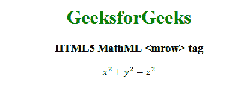

# HTML5 | MathML <mrow>标签</mrow>T3】

> 原文:[https://www.geeksforgeeks.org/html5-mathml-mrow-tag/](https://www.geeksforgeeks.org/html5-mathml-mrow-tag/)

HTML5 中的 **MathML < mrow >** 标记用于创建一行，其中包含一些数学表达式或任何随机文本。当你需要写一些数学表达式时，这个标签对表达式进行分组是很有用的。通过使用< mrow >表情会看起来更好看，干净有压痕加断线。

**语法:**

```html
<mrow> child elements </mrow>
```

**属性:**该标签接受下面列出的一些属性:

*   **class|id|style:** 该属性用于保存子元素的样式。
*   **href:** 此属性用于保存任何指向指定 URL 的超链接。
*   **数学背景:**该属性保存数学表达式背景颜色的值。
*   **mathcolor:** 该属性保存数学表达式的颜色。
*   **方向:**该属性保存方向值。它保存两种类型的方向值，从左到右为 ltr，从右到左为 rtl。

下面的例子将举例说明 HTML5 MathML 的概念<mrow>标记:
**例子:**</mrow>

## 超文本标记语言

```html
<!DOCTYPE html>
<html>

<head>
    <title>HTML5 MathML mrow tag</title>
</head>

<body style="text-align:center;">

    <h1 style="color:green">GeeksforGeeks</h1>

    <h3>HTML5 MathML <mrow> tag</h3>

    <math>
        <mrow>
            <mrow>
                <msup>
                    <mi>x</mi>
                    <mn>2</mn>
                </msup>
                <mo>+</mo>
                <msup>
                    <mi>y</mi>
                    <mn>2</mn>
                </msup>
            </mrow>
            <mo>=</mo>
            <msup>
                <mi>z</mi>
                <mn>2</mn>
            </msup>
        </mrow>
    </math>
</body>

</html>
```

**输出:**



**支持的浏览器:**下面列出了 **HTML5 MathML < mrow >** 标签支持的浏览器:

*   火狐浏览器
*   旅行队