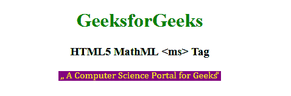

# HTML5 | MathML <ms>标签</ms>T3】

> 原文:[https://www.geeksforgeeks.org/html5-mathml-ms-tag/](https://www.geeksforgeeks.org/html5-mathml-ms-tag/)

HTML5 中的 **MathML < ms >** 标记用于表示字符串，该字符串将通过编程语言和计算机代数系统来表示数学表达式。默认情况下，字符串表达式用引号括起来。表达式的左侧用 l 引号括起来，表达式的右侧用 rquotes 括起来。< ms >标记的元素不是 ASCII 字符，而是**<【mglyph】>**和 **<恶性标记>** 标记的序列字符。

**语法:**

```html
<ms lquotes="„" rquote="“"> String Expression </ms>
```

**属性:**该标签接受下面列出的一些属性:

*   **class|id|style:** 该属性保存子元素的样式。
*   **dir:** 此属性保存方向两种类型的方向值从左到右和 rtl 从右到左是可接受的。
*   **href:** 该属性保存到指定网址的任何超链接。
*   **数学背景:**该属性保存数学表达式背景颜色的值。
*   **mathcolor:** 该属性保存数学表达式的颜色。
*   **mathsize:** 该属性保存内容的大小值。可能的值有小、中、大。
*   **mathvariant:** 该属性包含各种字体，如字体系列。
*   **lquote:** 该属性保存依赖于 dir 属性的开篇报价，默认值为”。

下面的例子将说明 HTML5 MathML <ms>标签的概念:</ms>

**示例:**

```html
<!DOCTYPE html>
<html>

<head>
    <title>HTML5 MathML ms tag</title>
</head>

<body style="text-align:center;">

    <h1 style="color:green">GeeksforGeeks</h1>

    <h3>HTML5 MathML <ms> Tag</h3>

    <math>
        <ms lquote="„" rquote="“" mathcolor="Yellow"
                mathbackground="Purple"> 
            A Computer Science Portal for Geeks
        </ms>
    </math>
</body>

</html>
```

**输出:**


**支持的浏览器:**浏览器支持的 **HTML5 MathML < ms >** 标签如下:

*   火狐浏览器