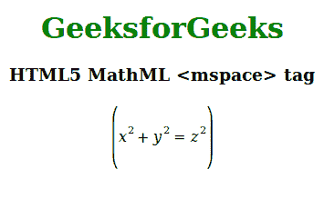

# HTML5 | MathML <mspace>标签</mspace>T3】

> 原文:[https://www.geeksforgeeks.org/html5-mathml-mspace-tag/](https://www.geeksforgeeks.org/html5-mathml-mspace-tag/)

HTML5 中的 **MathML < mspace >** 标签用于打印空白处。属性中必须提到空格的大小。

**语法:**

```html
<mspace attributes="value"/>
```

**属性:**该标签接受下面列出的一些属性:

*   **class|id|style:** 该属性保存子元素的样式。
*   **数学背景:**该属性保存数学表达式背景颜色的值。
*   **深度:**该属性保存深度值长度，即基线以下的期望深度。
*   **宽度:**该属性保存宽度值长度。
*   **高度:**该属性保存高度值长度，即基线上方的期望深度。
*   **换行符:**该属性定义行内的换行符。可能的值有`auto`、`newline`、`nobreak`、`goodbreak`和`badbreak`。

下面的例子说明了 HTML5 中的 MathML <mspace>标记:</mspace>

**示例:**

```html
<!DOCTYPE html>
<html>

<head>
    <title>HTML5 MathML mfenched tag</title>
</head>

<body>
    <center>
        <h1 style="color:green"> 
            GeeksforGeeks 
        </h1>

        <h3>HTML5 MathML <mspace> tag</h3>

        <math>
            <mfenced open="(" close=")" separators="">
                <mrow>
                    <msup>
                        <mi>x</mi>
                        <mn>2</mn>
                    </msup>
                    <mspace depth="20px" height="40px" />
                    <mo>+</mo>
                    <msup>
                        <mi>y</mi>
                        <mn>2</mn>
                    </msup>
                    <mo>=</mo>
                    <msup>
                        <mi>z</mi>
                        <mn>2</mn>
                    </msup>
                </mrow>
            </mfenched>
        </math>
    </center>
</body>

</html>
```

**输出:**


**支持的浏览器:**以下列出了**html 5 MathML<mspace>**标签支持的浏览器:

*   火狐浏览器