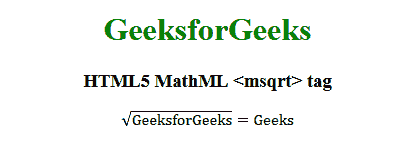

# HTML5 | MathML <msqrt>标签</msqrt>T3】

> 吴奇珍:t0]https://www . geeksforgeeks . org/html 5-mathml-msqrt 标签/

HTML5 中的 **MathML < msqrt >标签**用于显示元素内容的根 squire。

**语法:**

```html
<msqrt> Element contents </msqrt>
```

**属性:**该标签接受下面列出的一些属性:

*   **class|id|style:** 该属性用于保存子元素的样式。
*   **数学背景:**该属性保存数学表达式背景颜色的值。
*   **href:** 该属性用于保存任何指向指定网址的超链接。
*   **mathcolor:** 该属性保存数学表达式的颜色。

下面的例子将举例说明 HTML5 MathML 的概念<msqrt>标记:
**例子:**</msqrt>

## 超文本标记语言

```html
<!DOCTYPE html>
<html>

<head>
    <title>HTML5 MathML msqrt tag</title>
</head>

<body style="text-align:center;">

    <h1 style="color:green">GeeksforGeeks</h1>

    <h3>HTML5 MathML <msqrt> tag</h3>

    <math>
        <msqrt>
            <mi>GeeksforGeeks</mi>
        </msqrt>
        <mo>=</mo>
        <mtext>Geeks</mtext>
    </math>
</body>

</html>           
```

**输出:**



**支持的浏览器:**支持的浏览器有 **HTML5 MathML < msqrt >** 标签如下:

*   火狐浏览器
*   狩猎