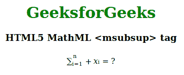

# HTML5 | MathML <msubsup>标签</msubsup>T3】

> 原文:[https://www.geeksforgeeks.org/html5-mathml-msubsup-tag/](https://www.geeksforgeeks.org/html5-mathml-msubsup-tag/)

HTML5 中的 **MathML < msubsup >** 标签用于打印任何表达式的基本功率和功率。这意味着上标和下标可以同时使用。

**语法:**

```html
<msubsup> child elements </msubsup>
```

**属性:**该标签接受下面列出的一些属性:

*   **class|id|style:** 该属性用于保存子元素的样式。
*   **数学背景:**该属性保存数学表达式背景颜色的值。
*   **href:** 此属性用于保存任何指向指定 URL 的超链接。
*   **mathcolor:** 该属性保存数学表达式的颜色。
*   **下标移位:**该属性定义了将下标移位到表达式基线以下的最小空间。
*   **上标移位:**该属性定义将上标移位到表达式基线之上的最小空间。

以下示例说明了 HTML5 中的 MathML <msubsup>标记:
**示例:**</msubsup>

## 超文本标记语言

```html
<!DOCTYPE html>
<html>

<head>
    <title>HTML5 MathML msubsup tag</title>
</head>

<body>
    <center>
        <h1 style="color:green">
            GeeksforGeeks
        </h1>

        <h3>HTML5 MathML <msubsup> tag</h3>

        <math>
            <mrow>
                <msubsup>
                    <mo> ∑</mo>
                    <mn> i=1 </mn>
                    <mn> n </mn>
                </msubsup>
                <mo>+</mo>
                <msub>
                    <mi>x</mi>
                    <mn>i</mn>
                </msub>
                <mo>=</mo>
                <mn>?</mn>
            </mrow>
        </math>
    </center>
</body>

</html>
```

**输出:**



**支持的浏览器:**以下列出了**html 5 MathML<msubsup>**标签支持的浏览器:

*   火狐浏览器
*   旅行队