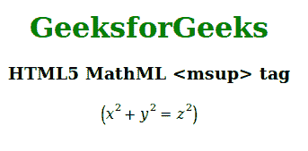

# HTML5 | MathML <msup>标签</msup>T3】

> 原文:[https://www.geeksforgeeks.org/html5-mathml-msup-tag/](https://www.geeksforgeeks.org/html5-mathml-msup-tag/)

HTML5 中的 **MathML < msup >** 标签用于打印任何表达式的功率。

**语法:**

```html
<msup> child elements </msup>
```

**属性:**该标签接受下面列出的一些属性:

*   **class|id|style:** 该属性用于保存子元素的样式。
*   **数学背景:**该属性保存数学表达式背景颜色的值。
*   **href:** 此属性用于保存任何指向指定 URL 的超链接。
*   **mathcolor:** 该属性保存数学表达式的颜色。
*   **上标移位:**该属性定义将上标移位到表达式基线之上的最小空间。

下面的例子说明了 HTML5 中的 MathML <msup>标记:</msup>

**示例:**

## 超文本标记语言

```html
<!DOCTYPE html>
<html>

<head>
    <title>HTML5 MathML msup tag</title>
</head>

<body>
    <center>
        <h1 style="color:green">
            GeeksforGeeks
        </h1>

        <h3>HTML5 MathML <msup> tag</h3>

        <math>
            <mfenced open="(" close=")" separators="">
                <mrow>
                    <msup>
                        <mi>x</mi>
                        <mn>2</mn>
                    </msup>
                    <mo>+</mo>
                    <msup>
                        <mi>y</mi>
                        <mn>2</mn>
                    </msup>
                    <mo>=</mo>
                    <msup>
                        <mi>z</mi>
                        <mn>2</mn>
                    </msup>
                </mrow>
            </mfenched>
        </math>
    </center>
</body>

</html>
```

**输出:**



**支持的浏览器:**以下列出了 **HTML5 MathML < msup >** 标签支持的浏览器:

*   火狐浏览器
*   旅行队