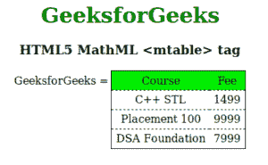

# HTML5 | MathML <mtable>标签</mtable>T3】

> 原文:[https://www.geeksforgeeks.org/html5-mathml-mtable-tag/](https://www.geeksforgeeks.org/html5-mathml-mtable-tag/)

**MathML < mtable >标签**用于在 HTML5 中创建表格或矩阵。这个标签类似于普通的 HTML <表格>标签。<表>有< tr >、< td >和< td >标签，同样它也有< mtr >、< mtd >和< mtd >标签，它们的作用相同。但是我们不使用<表格>和其他子标签来创建矩阵。这里<可移动>对创建矩阵很有用。因为 MathML 是关于 HTML 中的数学表达式表示的。

**语法:**

```html
<mtable attributes="value"> child elements </mtable>
```

**属性:**它接受下面列出的一些属性:

*   **对齐:**该属性保存表格的对齐方式。可能的值有轴、基线、底部、中心和顶部。
*   **class|id|style:** 该属性用于保存子元素的样式。
*   **columnalign:** 该属性保存表格单元格的水平对齐方式。可能的值是左、右和中间。
*   **列线:**该属性保存列线的边框样式值。可能的值是无、实线和虚线。
*   **displaystyle:** 是一个布尔值属性，定义是使用更多的垂直空间来显示公式，还是使用更紧凑的布局来显示公式。
*   **框架:**该属性保存整个表格的边框值。可能的值是无、实线和虚线。
*   **框架间距:**该属性定义表格和框架之间的空间。
*   **href:** 此属性用于保存任何指向指定 URL 的超链接。
*   **数学背景:**该属性保存数学表达式背景颜色的值。
*   **mathcolor:** 该属性保存数学表达式的颜色。
*   **rowalign:** 该属性保持表格单元格的垂直对齐。可能的值是顶部、底部和中心。
*   **罗琳:**该属性保存行边界值，可以用空格分隔多个值也可以考虑。可能的值是无、实线和虚线。
*   **宽度:**该属性保存宽度值长度。

**注意:**还有一些属性没有实现，比如行间距、边、最小标签间距、组对齐等。
下面的例子说明了 HTML5 中的 MathML < mtable >标签:

**示例:**

## 超文本标记语言

```html
<!DOCTYPE html>
<html>

<head>
    <title>HTML5 MathML mtable tag</title>
</head>

<body>
    <center>
        <h1 style="color:green">
            GeeksforGeeks
        </h1>

        <h3>HTML5 MathML <mtable> tag</h3>

        <math>
            <mi>GeeksforGeeks</mi>
            <mo>=</mo>
            <mtable frame="solid" rowlines="dashed" align="axis 1">
                <mtr mathbackground="green;">
                    <mtd>Course</mtd>
                    <mtd>Fee</mtd>
                </mtr>
                <mtr>
                    <mtd>
                        <mi>C++ STL</mi>
                    </mtd>
                    <mtd>
                        <mi> 1499</mi>
                    </mtd>
                </mtr>
                <mtr>
                    <mtd>
                        <mi>Placement 100 </mi>
                    </mtd>
                    <mtd>
                        <mi>9999 </mi>
                    </mtd>
                </mtr>
                <mtr>
                    <mtd>
                        <mi>DSA Foundation </mi>
                    </mtd>
                    <mtd>
                        <mi>7999</mi>
                    </mtd>
                </mtr>
            </mtable>
        </math>
    </center>
</body>

</html>
```

**输出:**



**支持的浏览器:**以下列出了**html 5 MathML<mtable>**标签支持的浏览器:

*   火狐浏览器
*   旅行队