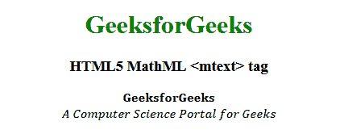

# HTML5 | MathML <mtext>标签</mtext>T3】

> 原文:[https://www.geeksforgeeks.org/html5-mathml-mtext-tag/](https://www.geeksforgeeks.org/html5-mathml-mtext-tag/)

HTML5 中的 **MathML <多行文字>标签**用于打印任意表达式前后的任意文本。您可以使用此标记来表示表达式，也可以为该表达式命名。用于打印此标签所使用的任何表达式的注释。
**语法:**

```html
<mtext attributes="values"> Random text </mtext>
```

**属性:**该标签接受以下列出的一些属性:

*   **class|id|style:** 该属性用于保存子元素的样式。
*   **href:** 此属性用于保存任何指向指定 URL 的超链接。
*   **数学背景:**该属性保存数学表达式背景颜色的值。
*   **mathcolor:** 该属性保存数学表达式的颜色。
*   **方向:**该属性保存方向值。两种类型的方向值是可接受的从左到右的 ltr 和从右到左的 rtl。
*   **mathsize:** 该属性保存内容的大小值。可能的数值有**小**、**中**和**大**。
*   **mathvariant:** 该属性包含各种字体，如字体系列。

以下示例说明了 HTML5 中的 MathML <mtext>标记:
**示例:**</mtext> 

## 超文本标记语言

```html
<!DOCTYPE html>
<html>

<head>
    <title>HTML5 MathML mtext tag</title>
    <style>
        mi {
            font-size:25px;
        }
    </style>
</head>

<body>
    <center>
        <h1 style="color:green">
            GeeksforGeeks
        </h1>

        <h3>HTML5 MathML <mtext> tag</h3>

        <math>
            <math>
                <mtext mathvariant="bold">
                    GeeksforGeeks
                </mtext>

                <br>
            </math>
            <math>
                <mtext mathvariant="italic">
                    A Computer Science
                    Portal for Geeks
                </mtext>
            </math>
        </math>
    </center>
</body>

</html>        
```

**输出:**



**支持的浏览器:**html 5**MathML<多行文字>标签**支持的浏览器如下:

*   火狐浏览器
*   旅行队