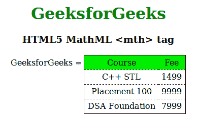

# HTML5 | MathML <mth>标签</mth>T3】

> 原文:[https://www.geeksforgeeks.org/html5-mathml-mth-tag/](https://www.geeksforgeeks.org/html5-mathml-mth-tag/)

**MathML < mth >标签**用于在 HTML5 中创建表格或矩阵的标题。它类似于表格标签的第<>。
**语法:**

```html
<mth attributes="value"> child elements </mth>
```

**属性:**接受以下列出的部分属性:

*   **class|id|style:** 该属性用于保存子元素的样式。
*   **columnalign:** 该属性保存表格单元格的水平对齐方式。可能的值是左、右和中间。
*   **href:** 此属性用于保存任何指向指定 URL 的超链接。
*   **数学背景:**该属性保存数学表达式背景颜色的值。
*   **mathcolor:** 该属性保存数学表达式的颜色。
*   **rowalign:** 该属性保持表格单元格的垂直对齐。可能的值是顶部、底部和中心。

以下示例说明了 HTML5 中的 MathML <mth>标记:
**示例:**</mth> 

## 超文本标记语言

```html
<!DOCTYPE html>
<html>

<head>
    <title>HTML5 MathML mth tag</title>
</head>

<body>
    <center>
        <h1 style="color:green">
            GeeksforGeeks
        </h1>

        <h3>HTML5 MathML <mth> tag</h3>

        <math>
            <mi>GeeksforGeeks</mi>
            <mo>=</mo>
            <mtable frame="solid" rowlines="dashed" align="axis 1">
                <mtr mathbackground="green;">
                    <mtd>Course</mtd>
                    <mtd>Fee</mtd>
                </mtr>
                <mtr>
                    <mtd>
                        <mi>C++ STL</mi>
                    </mtd>
                    <mtd>
                        <mi> 1499</mi>
                    </mtd>
                </mtr>
                <mtr>
                    <mtd>
                        <mi>Placement 100 </mi>
                    </mtd>
                    <mtd>
                        <mi>9999 </mi>
                    </mtd>
                </mtr>
                <mtr>
                    <mtd>
                        <mi>DSA Foundation </mi>
                    </mtd>
                    <mtd>
                        <mi>7999</mi>
                    </mtd>
                </mtr>
            </mtable>
        </math>
    </center>
</body>

</html>
```

**输出:**



**支持的浏览器:**html 5 MathML<mth>标签支持的浏览器如下:

*   火狐浏览器
*   旅行队