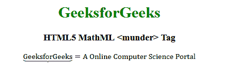

# HTML5 | MathML <munder>标签</munder>T3】

> 原文:[https://www.geeksforgeeks.org/html5-mathml-munder-tag/](https://www.geeksforgeeks.org/html5-mathml-munder-tag/)

HTML5 中的 **MathML < munder >标签**用于在表达式下附加任何重音或限制。
**语法:**

```html
<munder> base underscript</munder>
```

**属性:**该标签接受以下列出的一些属性:

*   **重音下:**该属性定义标签是否包含重音。可能的值是**真**表示元素是更接近基本表达式的重音，**假**表示元素是更接近基本表达式的极限。
*   **对齐:**该属性保存下脚本的对齐值。可能的值是左、右和中间。
*   **class|id|style:** 该属性用于保存子元素的样式。
*   **href:** 此属性用于保存任何指向指定 URL 的超链接。
*   **数学背景:**该属性保存数学表达式背景颜色的值。
*   **mathcolor:** 该属性保存数学表达式的颜色。

以下示例说明了 HTML5 的概念<munder>标签:
**示例:**</munder> 

## 超文本标记语言

```html
<!DOCTYPE html>
<html>

<head>
    <title>HTML5 MathML munder tag</title>
</head>

<body>
    <center>
        <h1 style="color:green">GeeksforGeeks</h1>

        <h3>HTML5 MathML <munder> Tag</h3>

        <math>
            <munder accentunder="true">
                <mrow>
                    <mi>GeeksforGeeks</mi>
                </mrow>
                <mo> ⏟ </mo>
            </munder>

            <mrow>

                <mo> = </mo>
                <mi>A Online Computer Science Portal</mi>
            </mrow>

        </math>
    </center>
</body>

</html>
```

**输出:**



**支持的浏览器:**以下列出了**html 5 MathML<munder>**标签支持的浏览器:

*   火狐浏览器
*   旅行队