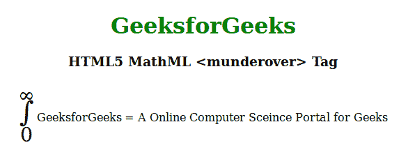

# HTML5 | MathML <munderover>标签</munderover>T3】

> 原文:[https://www.geeksforgeeks.org/html5-mathml-munderover-tag/](https://www.geeksforgeeks.org/html5-mathml-munderover-tag/)

HTML5 中的 **MathML < munderover >标记**用于在表达式下面加上表达式上面附加任何重音或限制。
**语法:**

```html
<munderover> base underscript </munderover>
```

**属性:**该标签接受以下列出的一些属性:

*   **重音:**该属性指定运算符是否应被视为重音。可能的值为真或假。
*   **重音下:**该属性定义标签是否包含重音。可能的值是**真**表示元素是更接近基本表达式的重音，**假**表示元素是更接近基本表达式的极限。
*   **对齐:**该属性保存下脚本的对齐值。可能的值是左、右和中间。
*   **class|id|style:** 该属性用于保存子元素的样式。
*   **href:** 该属性用于保存任何指向指定网址的超链接。
*   **数学背景:**该属性保存数学表达式背景颜色的值。
*   **mathcolor:** 该属性保存数学表达式的颜色。

以下示例说明了 HTML5 的概念<munderover>标签:
**示例:**</munderover> 

## 超文本标记语言

```html
<!DOCTYPE html>
<html>

<head>
    <title>HTML5 MathML munderover tag</title>
    <style>
        .munderover {
            font-size: 40px;
        }
    </style>
</head>

<body>
    <center>
        <h1 style="color:green">GeeksforGeeks</h1>

        <h3>HTML5 MathML <munderover> Tag</h3>

        <math>
            <munderover class="munderover">
                <mo> ∫ </mo>
                <mn> 0 </mn>
                <mi> ∞</mi>
            </munderover>
            <mrow>
                <mi>GeeksforGeeks</mi>
                <mo>=</mo>
                <mi>
                  A Online Computer Sceince
                  Portal for Geeks
                </mi>
            </mrow>
        </math>
    </center>
</body>

</html>
```

**输出:**



**支持的浏览器:**以下列出了**html 5 MathML<munderover>**标签支持的浏览器:

*   火狐浏览器
*   旅行队