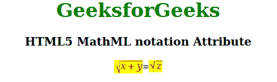

# HTML5 MathML 符号属性

> 原文:[https://www . geesforgeks . org/html 5-mathml-notation-attribute/](https://www.geeksforgeeks.org/html5-mathml-notation-attribute/)

该属性保存每个符号都被绘制为其他符号不存在的符号，一次使用多个符号可能会出现符号重叠。该属性仅被 [< menclose >](https://www.geeksforgeeks.org/html5-mathml-menclose-tag/) 标签接受。

**属性值:**

*   **精算:**此值用于设置精算。
*   **底部:**该值用于设置底部。
*   **框:**该值用于设置框。
*   **圆:**此值用于设置圆。
*   **向下对角修剪:**该值用于设置向下对角修剪。
*   **左侧:**该值用于设置左侧。
*   **龙迪夫:**该值用于设置龙迪夫。
*   **madruwb:** 该值用于设置 madruwb。
*   **相位角:**该值用于设置相位角。
*   **字根:**此值用于设置字根。
*   **右侧:**该值用于设置右侧。
*   **圆角盒:**该值用于设置圆角盒。
*   **top:** 该值用于设置 top。
*   **向上箭头:**该值用于设置向上箭头。
*   **向上倾斜冲击:**该值用于设置向上倾斜冲击。
*   **垂直搜索:**该值用于设置垂直搜索。

**示例:**下面的示例说明了 HTML5 MathML 中的*符号*属性。

## 超文本标记语言

```html
<!DOCTYPE html> 
<html> 

<body style="text-align:center;"> 

    <h1 style="color:green">GeeksforGeeks</h1> 

    <h3>HTML5 MathML notation Attribute</h3> 

    <math> 
        <math> 
            <menclose notation="radical"
                      mathbackground="yellow"
                      mathcolor="purple"> 
                <mrow> 
                    <mi> x </mi> 
                    <mo> + </mo> 
                    <mi> y </mi> 
                </mrow> 
            </menclose> 
            <mi>=</mi> 
            <menclose notation="radical"
                    mathbackground="yellow"
                    mathcolor="purple"> 
                <mi>z</mi> 
            </menclose> 
        </math> 
    </math> 
</body>
</html> 
```

**输出:**



**支持的浏览器:**html 5 MathML*符号*属性支持的浏览器如下。

*   火狐浏览器