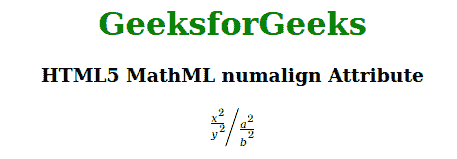

# html 5 MathML numerical 属性

> 原文:[https://www . geeksforgeeks . org/html 5-mathml-numerical-attribute/](https://www.geeksforgeeks.org/html5-mathml-numalign-attribute/)

该属性保存分子的对齐值，可能的值有*左*、*右*和*中*。该属性仅被 [< mfrac >](https://www.geeksforgeeks.org/html5-mathml-mfrac-tag/) 标签接受。

**语法:**

```html
<element numalign="left|right|center">

```

**属性值:**

*   **左侧:**该属性将分子设置在左侧。
*   **右侧:**该属性将分子设置在右侧。
*   **中心:**该属性将分子设置为中心。

**示例:**下面的示例说明了 HTML5 MatheML 中的*numerical*属性。

## 超文本标记语言

```html
<!DOCTYPE html> 
<html> 

<body> 
    <center> 
        <h1 style="color:green"> 
            GeeksforGeeks 
        </h1> 

        <h3>HTML5 MathML numalign Attribute</h3> 

        <math> 
            <mfrac bevelled="true"> 
                <mfrac numalign="center"> 
                    <msup> 
                        <mi>x</mi> 
                        <mn>2</mn> 
                    </msup> 
                    <msup> 
                        <mi>y</mi> 
                        <mn>2</mn> 
                    </msup> 
                </mfrac> 
                <mfrac> 
                    <msup> 
                        <mi>a</mi> 
                        <mn>2</mn> 
                    </msup> 
                    <msup> 
                        <mi>b</mi> 
                        <mn>2</mn> 
                    </msup> 
                </mfrac> 
            </mfrac> 
        </math> 
    </center> 
</body> 

</html> 
```

**输出:**



**支持的浏览器:**html 5 MathML*numerical*属性支持的浏览器如下

*   火狐浏览器