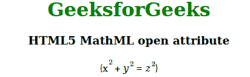

# HTML5 MathML 打开属性

> 原文:[https://www.geeksforgeeks.org/html5-mathml-open-attribute/](https://www.geeksforgeeks.org/html5-mathml-open-attribute/)

此属性保存任何等式的左括号，与 close 属性相同。该属性被 [<接受，并被>](https://www.geeksforgeeks.org/html5-mathml-mfenched-tag/) 标记。

**语法:**

```html
<element open="parentheses">
```

**属性值:**

*   **括号:**保存将用于打开任何方程的括号。

下面的例子说明了 HTML5 MathML 中打开的属性:

**例**:

## 超文本标记语言

```html
<!DOCTYPE html>
<html>

<head>
    <title>HTML5 MathML open attribute</title>
</head>

<body>
    <center>
        <h1 style="color:green">
            GeeksforGeeks
        </h1>

        <h3>HTML5 MathML open attribute</h3>
        <math>
            <mfenced open="{" close="}" separators="">
                <mrow>
                    <msup>
                        <mi>x</mi>
                        <mn>2</mn>
                    </msup>
                    <mo>+</mo>
                    <msup>
                        <mi>y</mi>
                        <mn>2</mn>
                    </msup>
                    <mo>=</mo>
                    <msup>
                        <mi>z</mi>
                        <mn>2</mn>
                    </msup>
                </mrow>
                </mfenced>
        </math>
    </center>
</body>

</html>
```

**输出:**



**支持的浏览器:**html 5 MathML open 属性支持的浏览器如下:

*   火狐浏览器