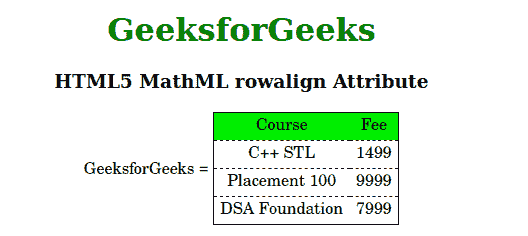

# HTML5 MathML rowalign 属性

> 原文:[https://www . geesforgeks . org/html 5-mathml-row align-attribute/](https://www.geeksforgeeks.org/html5-mathml-rowalign-attribute/)

此属性保持表格单元格的垂直对齐。可能的值是顶部、底部和中心。该属性被[<>](https://www.geeksforgeeks.org/html5-mathml-mtable-tag/)[<>](https://www.geeksforgeeks.org/html5-mathml-mtd-tag/)和 [< mtr >](https://www.geeksforgeeks.org/html5-mathml-mtr-tag/) 标签接受。

**语法:**

```html
<element rowalign="top|bottom|center">
```

**属性值:**

*   **顶部:**该属性设置行顶部的对齐方式。
*   **底部:**该属性设置行底部的对齐方式。
*   **中心:**该属性设置行中心的对齐方式。

以下示例说明了 HTML5 MathML 中的 rowalign 属性:

**示例:**

## 超文本标记语言

```html
<!DOCTYPE html> 
<html> 

<head> 
    <title>HTML5 MathML rowalign Attribute</title> 
</head> 

<body> 
    <center> 
        <h1 style="color:green"> 
            GeeksforGeeks 
        </h1> 

        <h3>HTML5 MathML rowalign Attribute</h3> 

        <math> 
            <mi>GeeksforGeeks</mi> 
            <mo>=</mo> 
            <mtable frame="solid" rowlines="dashed"
                rowalign="bottom"> 

                <mtr mathbackground="green;"> 
                    <mtd>Course</mtd> 
                    <mtd>Fee</mtd> 
                </mtr> 
                <mtr> 
                    <mtd> 
                        <mi>C++ STL</mi> 
                    </mtd> 
                    <mtd> 
                        <mi> 1499</mi> 
                    </mtd> 
                </mtr> 
                <mtr> 
                    <mtd> 
                        <mi>Placement 100 </mi> 
                    </mtd> 
                    <mtd> 
                        <mi>9999 </mi> 
                    </mtd> 
                </mtr> 
                <mtr> 
                    <mtd> 
                        <mi>DSA Foundation </mi> 
                    </mtd> 
                    <mtd> 
                        <mi>7999</mi> 
                    </mtd> 

                </mtr> 
            </mtable> 
        </math> 
    </center> 
</body> 

</html> 
```

**输出:**



**支持的浏览器:**html 5 MathML row align 属性支持的浏览器如下:

*   火狐浏览器