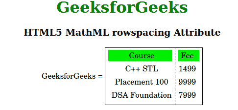

# HTML5 MathML 行距属性

> 原文:[https://www . geesforgeks . org/html 5-mathml-row spacing-attribute/](https://www.geeksforgeeks.org/html5-mathml-rowspacing-attribute/)

HTML5 中的 **MathML** **行间距**属性用于指定表格的行间距。长度值可以使用任何 CSS 长度单位来指定。该属性可由 [<可移动>](https://www.geeksforgeeks.org/html5-mathml-mtable-tag/) 标记使用。

**语法:**

```html
<element rowspacing="number">
```

**属性值:**该属性具有如上所述的单一值，如下所述:

*   **number:** 该值可用于将表格的行间距设置为任意大小。

以下示例说明了 **MathML 行间距**属性:

**示例:**

## 超文本标记语言

```html
<!DOCTYPE html>
<html>

<body>
    <center>
        <h1 style="color:green">
            GeeksforGeeks
        </h1>
        <h3>
            HTML5 MathML rowspacing Attribute
        </h3>
        <math>
            <mi>GeeksforGeeks</mi>
            <mo>=</mo>
            <mtable frame="solid" columnlines="dashed" 
                rowspacing="2">

                <mtr mathbackground="green;">
                    <mtd>Course</mtd>
                    <mtd>Fee</mtd>
                </mtr>
                <mtr>
                    <mtd>
                        <mi>C++ STL</mi>
                    </mtd>
                    <mtd>
                        <mi> 1499</mi>
                    </mtd>
                </mtr>
                <mtr>
                    <mtd>
                        <mi>Placement 100 </mi>
                    </mtd>
                    <mtd>
                        <mi>9999 </mi>
                    </mtd>
                </mtr>
                <mtr>
                    <mtd>
                        <mi>DSA Foundation </mi>
                    </mtd>
                    <mtd>
                        <mi>7999</mi>
                    </mtd>
                </mtr>
            </mtable>
        </math>
    </center>
</body>

</html>
```

**输出:**



**支持的浏览器:**以下列出了 **HTML5 MathML 行距**属性支持的浏览器:

*   火狐浏览器