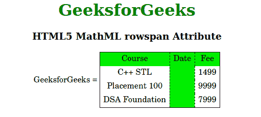

# HTML5 MathML 行跨度属性

> 原文:[https://www . geesforgeks . org/html 5-mathml-row span-attribute/](https://www.geeksforgeeks.org/html5-mathml-rowspan-attribute/)

该属性保存单元格扩展多少行的值。该属性仅被 [< mtd >](https://www.geeksforgeeks.org/html5-mathml-mtd-tag/) 标签接受。

**语法:**

```html
<element rowspan="non-negative-int">
```

**属性值:**

*   **非负整数:**该值保存按行创建跨度的整数。

下面的例子说明了超文本标记语言中的行跨度:

**示例:**

## 超文本标记语言

```html
<!DOCTYPE html> 
<html> 

<head> 
    <title>HTML5 MathML rowspan Attribute</title> 
</head> 

<body> 
    <center> 
        <h1 style="color:green"> 
            GeeksforGeeks 
        </h1> 

        <h3>HTML5 MathML rowspan Attribute</h3> 

        <math> 
            <mi>GeeksforGeeks</mi> 
            <mo>=</mo> 
            <mtable frame="solid" columnlines="dashed"> 
                <mtr mathbackground="green;"> 
                    <mtd>Course</mtd>
                    <mtd rowspan="4">Date</mtd>
                    <mtd>Fee</mtd> 
                </mtr> 
                <mtr> 
                    <mtd> 
                        <mi>C++ STL</mi> 
                    </mtd> 
                    <mtd> 
                        <mi> 1499</mi> 
                    </mtd> 
                </mtr> 
                <mtr> 
                    <mtd> 
                        <mi>Placement 100 </mi> 
                    </mtd> 
                    <mtd> 
                        <mi>9999 </mi> 
                    </mtd> 
                </mtr> 
                <mtr> 
                    <mtd> 
                        <mi>DSA Foundation </mi> 
                    </mtd> 
                    <mtd> 
                        <mi>7999</mi> 
                    </mtd> 
                </mtr> 
            </mtable> 
        </math> 
    </center> 
</body> 

</html>
```

**输出:**



**支持的浏览器:**html 5 MathML row span 属性支持的浏览器如下:

*   火狐浏览器