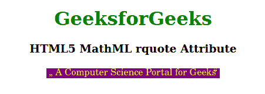

# HTML5 MathML rquote 属性

> 原文:[https://www . geesforgeks . org/html 5-mathml-rquote-attribute/](https://www.geeksforgeeks.org/html5-mathml-rquote-attribute/)

该属性保存依赖于*目录*属性的开始报价，默认值为”。该属性仅被[<>](https://www.geeksforgeeks.org/html5-mathml-ms-tag/)女士标签接受。

**语法:**

```html
<element rquote="quote">

```

**属性值:**

*   **报价:**该值可以是任意收盘报价。

**示例:**下面的示例说明了 HTML5 MathML 中的 *rquote* 。

## 超文本标记语言

```html
<!DOCTYPE html> 
<html> 

<body style="text-align:center;"> 

    <h1 style="color:green">GeeksforGeeks</h1>    
    <h3>HTML5 MathML rquote Attribute</h3> 

    <math> 
        <ms lquote="„" rquote=" “" mathcolor="Yellow"
                mathbackground="Purple"> 
            A Computer Science Portal for Geeks
        </ms> 
    </math> 
</body> 

</html> 
```

**输出:**



**支持的浏览器:**html 5 MathML*rquote*属性支持的浏览器如下:

*   火狐浏览器