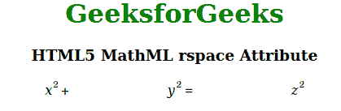

# HTML5 MathML rspace 属性

> 原文:[https://www . geesforgeks . org/html 5-mathml-rspace-attribute/](https://www.geeksforgeeks.org/html5-mathml-rspace-attribute/)

此属性保存运算符默认值 thickmathspace (4.32px)之后的空间长度值。此属性仅被 MathML [< mo >](https://www.geeksforgeeks.org/html5-mathml-mo-tag/) 标签接受。

**语法:**

```html
<element lspace="length">
```

**属性值:**

*   **长度:**此属性保存运算符默认值为 thickmathspace (4.32px)后的空间长度值。

下面的例子说明了 HTML5 中的 rspace 属性:

**示例:**

## 超文本标记语言

```html
<!DOCTYPE html> 
<html> 

<head> 
    <title>HTML5 MathML rspace Attribute</title> 
</head> 

<body style="text-align:center;"> 

    <h1 style="color:green"> 
        GeeksforGeeks 
    </h1> 

    <h3>HTML5 MathML rspace Attribute</h3> 

    <math> 
        <mpadded> 
            <mrow> 
                <mrow> 
                    <msup> 
                        <mi>x</mi> 
                        <mn>2</mn> 
                    </msup> 
                    <mo rspace="120px">+</mo > 
                    <msup> 
                        <mi>y</mi> 
                        <mn>2</mn> 
                    </msup> 
                </mrow> 
                <mo rspace="120px">=</mo> 
                <msup> 
                    <mi>z</mi> 
                    <mn>2</mn> 
                </msup> 
            </mrow> 
        </mpadded> 
    </math> 
</body> 

</html>
```

**输出:**



**支持的浏览器:**html 5 MathML rspace 属性支持的浏览器如下:

*   火狐浏览器