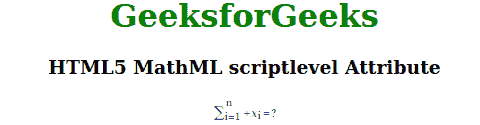

# HTML5 MathMl 脚本级属性

> 原文:[https://www . geesforgeks . org/html 5-mathml-script level-attribute/](https://www.geeksforgeeks.org/html5-mathml-scriptlevel-attribute/)

该属性保存控制字体大小的值。它像优先级属性一样工作，这意味着优先级值越高，性能越低。这意味着脚本级别越高，字体越小。该属性仅被 [< mstyle >](https://www.geeksforgeeks.org/html5-mathml-style-tag/) 标签接受。

**语法:**

```html
<element scriptlevel="number">
```

**属性值:**

*   **编号:**该值用于定义字体大小，类似于优先级属性，表示优先级值越高，性能越低。

下面的例子说明了 HTML5 中的脚本级别:

**示例:**

## 超文本标记语言

```html
<!DOCTYPE html> 
<html> 

<head> 
    <title>HTML5 MathML scriptlevel Attribute</title> 
</head> 

<body> 
    <center> 
        <h1 style="color:green"> 
            GeeksforGeeks 
        </h1> 

        <h3>HTML5 MathML scriptlevel Attribute</h3> 

        <math> 
            <mstyle displaystyle="true"
                    mathcolor="purple"
                    scriptlevel="2"> 
                <mrow> 
                    <msubsup> 
                        <mo>∑</mo> 
                        <mn> i=1 </mn> 
                        <mn> n </mn> 
                    </msubsup> 
                    <mo>+</mo> 
                    <msub> 
                        <mi>x</mi> 
                        <mn>i</mn> 
                    </msub> 
                    <mo>=</mo> 
                    <mn>?</mn> 
                </mrow> 
            </mstyle> 
        </math> 
    </center> 
</body> 

</html> 
```

**输出:**



**支持的浏览器:**html 5 MathML script level 属性支持的浏览器如下:

*   火狐浏览器