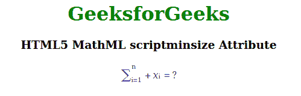

# HTML5 MathML 脚本化属性

> 原文:[https://www . geesforgeks . org/html 5-mathml-scriptminsize-attribute/](https://www.geeksforgeeks.org/html5-mathml-scriptminsize-attribute/)

由于脚本级别的变化，该属性保持用于调整字体大小的最小值。它的默认值是 0.71。该属性仅被 [< mstyle >](https://www.geeksforgeeks.org/html5-mathml-style-tag/) 标签接受。

**语法:**

```html
<element scriptminsize="number">
```

**属性值:**

*   **数字:**该值用于设置由于 scriptlevel 变化而允许的最小字体大小。

下面的例子说明了 HTML5 中的脚本大小:

**示例:**

## 超文本标记语言

```html
<!DOCTYPE html> 
<html> 

<body> 
    <center> 
        <h1 style="color:green"> 
            GeeksforGeeks 
        </h1> 

        <h3>HTML5 MathML scriptminsize Attribute</h3> 

        <math> 
            <mstyle displaystyle="true"
                    mathcolor="purple"
                    scriptlevel="0"
                    scriptminsize="2"> 
                <mrow> 
                    <msubsup> 
                        <mo>∑</mo> 
                        <mn> i=1 </mn> 
                        <mn> n </mn> 
                    </msubsup> 
                    <mo>+</mo> 
                    <msub> 
                        <mi>x</mi> 
                        <mn>i</mn> 
                    </msub> 
                    <mo>=</mo> 
                    <mn>?</mn> 
                </mrow> 
            </mstyle> 
        </math> 
    </center> 
</body> 

</html>
```

**输出:**



**支持的浏览器:**html 5 MathML script minsize 属性支持的浏览器如下:

*   火狐浏览器