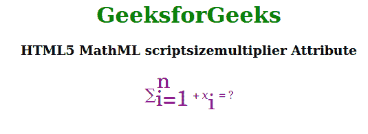

# html 5 MathML script size 乘数属性

> 原文:[https://www . geesforgeks . org/html 5-mathml-scriptsizemultiplier-attribute/](https://www.geeksforgeeks.org/html5-mathml-scriptsizemultiplier-attribute/)

HTML5 中的**MathML script sizemultiplier**属性用于指定由于 *scriptlevel* 的变化而用于调整字体大小的乘数。该属性的默认值为 0.71。该属性仅被 [< mstyle >](https://www.geeksforgeeks.org/html5-mathml-style-tag/) 标签接受。

**语法:**

```html
<element scriptsizemultiplier="number">
```

**属性值:**该属性具有如上所述的单一值，如下所述:

*   **数字:**该值用于指定因 scriptlevel 变化而调整字体大小所用的乘数。

下面的例子说明了**MathML script sizemultiplier**属性:

**示例:**

## 超文本标记语言

```html
<!DOCTYPE html>
<html>

<body>
    <center>
        <h1 style="color:green">
            GeeksforGeeks
        </h1>

        <h3>
            HTML5 MathML scriptsizemultiplier
            Attribute
        </h3>

        <math>
            <mstyle displaystyle="true"
                mathcolor="purple" scriptlevel="0" 
                scriptsizemultiplier="2">

                <mrow>
                    <msubsup>
                        <mo>∑</mo>
                        <mn> i=1 </mn>
                        <mn> n </mn>
                    </msubsup>
                    <mo>+</mo>
                    <msub>
                        <mi>x</mi>
                        <mn>i</mn>
                    </msub>
                    <mo>=</mo>
                    <mn>?</mn>
                </mrow>
            </mstyle>
        </math>
    </center>
</body>

</html>
```

**输出:**



**支持的浏览器:**以下列出了**html 5 MathML script sizemultiplier**属性支持的浏览器:

*   火狐浏览器