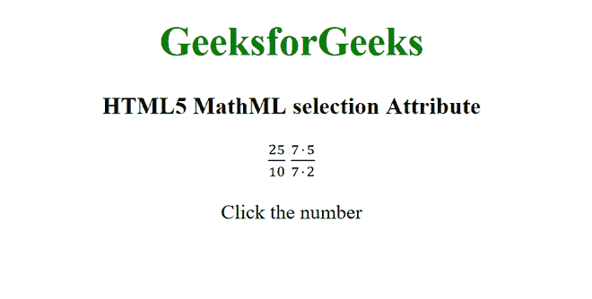

# HTML5 MathML 选择属性

> 原文:[https://www . geesforgeks . org/html 5-mathml-selection-attribute/](https://www.geeksforgeeks.org/html5-mathml-selection-attribute/)

HTML5 中的 **MathML 选择**属性用于指定应该用于查看的子元素。该值可以介于 1 和元素的子元素数量之间。该属性的默认值为 1，这意味着默认情况下将查看所有选项的第一个子元素。该属性被[<>](https://www.geeksforgeeks.org/html5-mathml-maction-tag/)标签接受。

**语法:**

```html
<element selection="index">
```

**属性值:**该属性具有如上所述的单一值，如下所述:

*   **索引:**保存要查看的子元素的索引。

以下示例说明了 **MathML 选择**属性:

**示例:**

## 超文本标记语言

```html
<!DOCTYPE html>
<html>

<body>
    <center>
        <h1 style="color:green">
            GeeksforGeeks
        </h1>
        <h3>HTML5 MathML selection Attribute</h3>
        <math>

            <!-- Selecting the first 
            option by default -->
            <maction actiontype="toggle" selection="1">
                <mfrac>
                    <mn>25</mn>
                    <mn>10</mn>
                </mfrac>
                <mfrac>
                    <mrow>
                        <mn>5</mn>
                        <mo>⋅</mo>
                        <mn>5</mn>
                    </mrow>
                    <mrow>
                        <mn>2</mn>
                        <mo>⋅</mo>
                        <mn>5</mn>
                    </mrow>
                </mfrac>
                <mfrac>
                    <mn>5</mn>
                    <mn>2</mn>
                </mfrac>
            </maction>

            <!-- Selecting the second
            option by default -->
            <maction actiontype="toggle" selection="2">
                <mfrac>
                    <mn>35</mn>
                    <mn>14</mn>
                </mfrac>
                <mfrac>
                    <mrow>
                        <mn>7</mn>
                        <mo>⋅</mo>
                        <mn>5</mn>
                    </mrow>
                    <mrow>
                        <mn>7</mn>
                        <mo>⋅</mo>
                        <mn>2</mn>
                    </mrow>
                </mfrac>
                <mfrac>
                    <mn>5</mn>
                    <mn>2</mn>
                </mfrac>
            </maction>
        </math>

        <p>Click the number</p>

    </center>
</body>

</html>
```

**输出:**



**支持的浏览器:****html 5 MathML 选择**属性支持的浏览器如下:

*   火狐浏览器