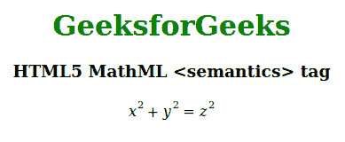

# HTML5 | MathML <semantics>标签</semantics>T3】

> 原文:[https://www.geeksforgeeks.org/html5-mathml-semantics-tag/](https://www.geeksforgeeks.org/html5-mathml-semantics-tag/)

HTML5 MathML **<语义>** 标签是 HTML5 中的一个内置元素。它用来标记数学有两种可能的方法来标记数学。

*   **演示** MathML 用于控制任何数学方程的布局。
*   **内容** MathML 旨在对语义数学意义进行编码，并使表达式为计算机代数系统所理解。

这个标记充当应该包含子元素的容器元素。还有两个使用该标签的标签，它们是**<>**标签和 **<注释-xml >** 。这个标签 **<注释>** 元素是这些元素的容器，包含非 xml 格式的语义信息，而 **<注释-xml >** 元素包含 XML 格式的内容，如 Content MathML 或 OpenMath。

**语法:**

```html
<semantics> child elements </semantics>
```

**属性:**这个标签接受下面提到的属性，并且必须在 **<注释>** 和 **<注释-xml >** 上使用这些属性。

*   **定义定义:**该属性保存注释符号的位置。
*   **编码:**该属性用于对标注中的语义信息进行编码。
*   **cd:** 该属性用于保存标注符号。
*   **名称:**该属性保存标注关键符号的名称。
*   **src:** 该属性保存语义信息的外部来源的位置。

下面的例子说明了 HTML 5 中的 **<语义>** 标记:

```html
<!DOCTYPE html>
<html>

<head>
    <title>HTML 5 MathML <semantics> tag</title>
</head>

<body>
    <center>
        <h1 style="color:green"> 
            GeeksforGeeks 
        </h1>

        <h3>HTML5 MathML <semantics> tag</h3>

        <math>
            <semantics>

                <!-- Presentation MathML -->
                <mrow>
                    <msup>
                        <mi>x</mi>
                        <mn>2</mn>
                    </msup>
                    <mo>+</mo>
                    <msup>
                        <mi>y</mi>
                        <mn>2</mn>
                    </msup>
                    <mo>=</mo>
                    <msup>
                        <mi>z</mi>
                        <mn>2</mn>
                    </msup>
                </mrow>

                <!-- Content MathML -->
                <annotation-xml encoding="MathML-Content">
                    <apply>
                        <plus/>
                        <apply>
                            <power/>
                            <ci>x</ci>
                            <cn type="integer">2</cn>
                        </apply>
                        <apply>
                            <power/>
                            <ci>y</ci>
                            <cn type="integer">2</cn>
                        </apply>
                        <equal/>
                        <apply>
                            <power/>
                            <ci>z</ci>
                            <cn type="integer">2</cn>
                        </apply>
                    </apply>
                </annotation-xml>

                <!-- annotate of an image -->
                <annotation encoding="image/png" src=
"https://media.geeksforgeeks.org/wp-content/uploads/20191226151654/762.png" />

                <!-- annotate of Text -->
                <annotation encoding="application/x-tex">
                    x^{2} + y^{2} = z^{2}
                </annotation>

            </semantics>
        </math>
    </center>
</body>
</html>                    
```

**输出:**


**支持的浏览器:**HTML 5 MathML<语义> 标签支持的浏览器如下:

*   火狐浏览器