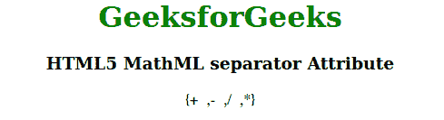

# HTML5 MathML 分隔符属性

> 原文:[https://www . geesforgeks . org/html 5-mathml-分隔符-属性/](https://www.geeksforgeeks.org/html5-mathml-separator-attribute/)

HTML5 中的 **MathML 分隔符**属性用于指定运算符是否为分隔符。使用此属性时没有视觉效果，因此这可能用于语义目的。这个属性被 [<莫>](https://www.geeksforgeeks.org/html5-mathml-mo-tag/) 标记接受。

**语法:**

```html
<element separator="symbol">

```

**属性值:**该属性有两个值，如上所述，描述如下:

*   **true:** 指定运算符为分隔符。
*   **false:** 指定运算符不是分隔符。

以下示例说明了 **MathML 分隔符**属性:

**示例:**

## 超文本标记语言

```html
<!DOCTYPE html>
<html>

<body style="text-align:center;">

    <h1 style="color:green">
        GeeksforGeeks
    </h1>

    <h3>HTML5 MathML separator Attribute</h3>

    <math>
        <mfenced>
            <mo separator="true">+</mo>
            <mo>-</mo>
            <mo>/</mo>
            <mo>*</mo>
        </mfenced>
    </math>
</body>

</html>
```

**输出:**



**支持的浏览器:****html 5 MathML 分隔符**属性支持的浏览器如下:

*   火狐浏览器