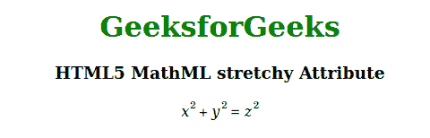

# HTML5 MathML 伸缩属性

> 原文:[https://www . geesforgeks . org/html 5-mathml-stretch y-attribute/](https://www.geeksforgeeks.org/html5-mathml-stretchy-attribute/)

此属性定义运算符是否延伸到相邻元素的大小。可能的值为真或假。该属性仅被 [< mo >](https://www.geeksforgeeks.org/html5-mathml-mo-tag/) 标签接受。

**语法:**

```html
<element stretchy="true|false">

```

**属性值:**

*   **true:** 该值定义操作符拉伸到相邻元素的大小。
*   **false:** 该值定义运算符拉伸不到相邻元素的大小。

以下示例说明了弹性属性:

**示例:**

## 超文本标记语言

```html
<!DOCTYPE html> 
<html> 
<body style="text-align:center;"> 
    <h1 style="color:green"> 
        GeeksforGeeks 
    </h1> 
    <h3>HTML5 MathML stretchy Attribute</h3> 
    <math> 
        <mrow> 
            <mrow> 
                <msup> 
                    <mi>x</mi> 
                    <mn>2</mn> 
                </msup> 
                <mo stretchy="true">+</mo> 
                <msup> 
                    <mi>y</mi> 
                    <mn>2</mn> 
                </msup> 
            </mrow> 
            <mo stretchy="false">=</mo> 
            <msup> 
                <mi>z</mi> 
                <mn>2</mn> 
            </msup> 
        </mrow> 
    </math> 
</body> 
</html> 
```

**输出:**



上面代码的输出

**支持的浏览器:**伸缩属性支持的浏览器如下:

*   火狐浏览器