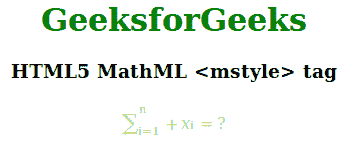

# HTML5 | MathML <mstyle>标签</mstyle>T3】

> 原文:[https://www.geeksforgeeks.org/html5-mathml-style-tag/](https://www.geeksforgeeks.org/html5-mathml-style-tag/)

**MathML < mstyle >标签**是 HTML5 中的一个内置标签。该标签用于更改儿童元素的样式。该标签适用于 HTML5 MathML 库中包含的标签。

**语法:**

```html
<mstyle attribute="value"> children tags </mstyle>
```

**属性:**该标签接受以下描述的一些属性:

*   **十进制点:**如果对齐值用小数点描述，则该属性保存对齐值。
*   **方向:**该属性保存方向值。两种类型的方向值是可接受的 ltr(从左到右)和 rtl(从右到左)。
*   **displaystyle:** 该属性保存用于显示等式的更多垂直空间，或者，它是一个布尔值。如果设置为 true，则显示更大版本的运算符。这部分取决于< mo >标签的**大尺寸**和**可移动极限**。
*   **脚本级别:**该属性保存字体大小的值。它像优先级属性一样工作，这意味着优先级值越高，性能越低。这意味着脚本级别越高，字体越小。
*   **scriptminsize:** 该属性保存由于 scriptlevel 的变化而用于调整字体大小的乘数值。它的默认值是 0.71。

下面的例子说明了 HTML5 MathMl <mstyle>标签:
**例子:**</mstyle>

## 超文本标记语言

```html
<!DOCTYPE html>
<html>

<head>
    <title>HTML5 MathML <mstyle> tag</title>
</head>

<body>
    <center>
        <h1 style="color:green">
            GeeksforGeeks
        </h1>

        <h3>HTML5 MathML <mstyle> tag</h3>

        <math>
            <mstyle displaystyle="true"
                    mathcolor="lightgreen">
                <mrow>
                    <msubsup>
                        <mo>∑</mo>
                        <mn> i=1 </mn>
                        <mn> n </mn>
                    </msubsup>
                    <mo>+</mo>
                    <msub>
                        <mi>x</mi>
                        <mn>i</mn>
                    </msub>
                    <mo>=</mo>
                    <mn>?</mn>
                </mrow>
            </mstyle>
        </math>
    </center>
</body>

</html>
```

**输出:**



**支持的浏览器:**以下列出了 **HTML5 MathML < mstyle >标签**支持的浏览器:

*   火狐浏览器
*   旅行队