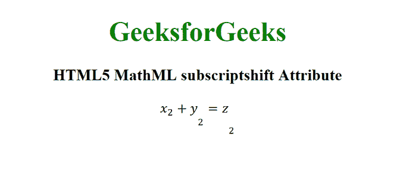

# HTML5 MathML 下标移位属性

> 原文:[https://www . geesforgeks . org/html 5-mathml-下标 shift-attribute/](https://www.geeksforgeeks.org/html5-mathml-subscriptshift-attribute/)

HTML5 中的 **MathML 下标 shift** 属性用于定义下标移动到表达式基线以下的最小量。长度值可以使用任何 CSS 长度单位来指定。该属性被 [<免疫脚本>](https://www.geeksforgeeks.org/html5-mathml-mmultiscripts-tag/) 、 [< msub >](https://www.geeksforgeeks.org/html5-mathml-msub-tag/) 和[<msub up>](https://www.geeksforgeeks.org/html5-mathml-msubsup-tag/)标签接受。

**语法:**

```html
<element subscriptshift="length">

```

**属性值:**该属性具有如上所述的单一值，如下所述:

*   **长度:**该值表示下标移动到基线以下的量。

下面的例子说明了 **MathML 下标 shift** 属性:

**示例:**

## 超文本标记语言

```html
<!DOCTYPE html>
<html>

<body>
    <center>
        <h1 style="color:green">
            GeeksforGeeks
        </h1>

        <h3>
            HTML5 MathML subscriptshift Attribute
        </h3>

        <math>
            <mfenced>
                <mrow>
                    <msub>
                        <mi>x</mi>
                        <mn>2</mn>
                    </msub>
                    <mo>+</mo>
                    <msub subscriptshift="15px">
                        <mi>y</mi>
                        <mn>2</mn>
                    </msub>
                    <mo>=</mo>
                    <msub subscriptshift="25px">
                        <mi>z</mi>
                        <mn>2</mn>
                    </msub>
                </mrow>
            </mfenced>
        </math>
    </center>
</body>

</html>
```

**输出:**



**支持的浏览器:**以下列出了 **HTML5 MathML 下标 shift** 属性支持的浏览器:

*   火狐浏览器