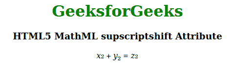

# HTML5 MathML supscriptshift 属性

> 原文:[https://www . geesforgeks . org/html 5-mathml-supscriptshift-attribute/](https://www.geeksforgeeks.org/html5-mathml-supscriptshift-attribute/)

该属性定义了将 supscript 移到表达式基线以下的最小空间。该属性被[<>](https://www.geeksforgeeks.org/html5-mathml-mmultiscripts-tag/)[<msub>](https://www.geeksforgeeks.org/html5-mathml-msub-tag/)和[<msub up>](https://www.geeksforgeeks.org/html5-mathml-msubsup-tag/)标签接受。

**语法:**

```html
<element supscriptshift length="length">
```

**属性值:**

*   **长度:**该属性保存特定单位的数字，该数字将在基线以下的 supscriptshift 上移动。

下面的例子说明了 HTML5 MathML 中的 supscriptshift:

**示例:**

```html
<!DOCTYPE html>
<html>

<head>
    <title>
        HTML5 MathML supscriptshift Attribute
    </title>
</head>

<body>
    <center>
        <h1 style="color:green">
            GeeksforGeeks
        </h1>

        <h3>
            HTML5 MathML supscriptshift Attribute
        </h3>

        <math>
            <mfenced>
                <mrow>
                    <msub supscriptshift="5px">
                        <mi>x</mi>
                        <mn>2</mn>
                    </msub>
                    <mo>+</mo>
                    <msub supscriptshift="5px">
                        <mi>y</mi>
                        <mn>2</mn>
                    </msub>
                    <mo>=</mo>
                    <msub supscriptshift="5px">
                        <mi>z</mi>
                        <mn>2</mn>
                    </msub>
                </mrow>
            </mfenced>
        </math>
    </center>
</body>

</html>     
```

**输出:**



**支持的浏览器:**支持的浏览器 **supscriptshift** 属性如下:

*   火狐浏览器