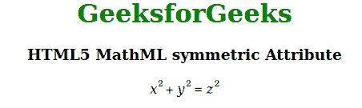

# HTML5 MathML 对称属性

> 原文:[https://www . geesforgeks . org/html 5-mathml-对称-attribute/](https://www.geeksforgeeks.org/html5-mathml-symmetric-attribute/)

如果*弹性*属性设置为*真*，它指定操作者是否应该围绕假想的数学轴垂直对称。该属性仅被 [< mo >](https://www.geeksforgeeks.org/html5-mathml-mo-tag/) 标签接受。

**语法:**

```html
<element symmetric="true|false">

```

**属性值:**

*   **true:** 它指定运算符应该围绕假想的数学轴垂直对称。
*   **false:** 它指定运算符不应围绕假想的数学轴垂直对称。

**示例:**下面的示例说明了 HTML5 MathML 中的对称属性。

## 超文本标记语言

```html
<!DOCTYPE html> 
<html> 

<body style="text-align:center;"> 

    <h1 style="color:green"> 
        GeeksforGeeks 
    </h1> 

    <h3>HTML5 MathML symmetric Attribute</h3> 

    <math> 
        <mrow> 
            <mrow> 
                <msup> 
                    <mi>x</mi> 
                    <mn>2</mn> 
                </msup> 
                <mo stretchy="true" 
                    symmetric="true">+</mo>

                <msup> 
                    <mi>y</mi> 
                    <mn>2</mn> 
                </msup> 
            </mrow> 
            <mo>=</mo> 
            <msup> 
                <mi>z</mi> 
                <mn>2</mn> 
            </msup> 
        </mrow> 
    </math> 
</body> 

</html>
```

**输出:**



**支持的浏览器:**对称属性支持的浏览器如下

*   火狐浏览器