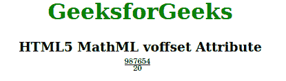

# HTML5 MathML voffset 属性

> 原文:[https://www . geesforgeks . org/html 5-mathml-voffset-attribute/](https://www.geeksforgeeks.org/html5-mathml-voffset-attribute/)

该属性用于设置垂直位置或增量。这个属性只有一个标签接受，那就是 [<加>](https://www.geeksforgeeks.org/html5-mathml-mpadded-tag/) 标签。

**语法:**

```html
<element voffset="length">
```

**属性值:**

*   **长度:**该属性值保存特定单位的数字，该数字将向下移动或向上拉基线。

下面的例子说明了 HTML5 MathML 中的 voffset:

**示例:**

## 超文本标记语言

```html
<!DOCTYPE html>
<html>

<head>
    <title>HTML5 MathML voffset Attribute</title>
</head>

<body style="text-align:center;">

    <h1 style="color:green">
        GeeksforGeeks
    </h1>

    <h3>HTML5 MathML voffset Attribute</h3>

    <math>
        <mrow>
            <mpadded lspace="2em" voffset="1em" 
                height="1em" depth="3em" 
                width="7em">

                <mfrac>
                    <mn>987654</mn>
                    <mn>20</mn>
                </mfrac>
            </mpadded>
        </mrow>
    </math>
</body>

</html>
```

**输出:**



**支持的浏览器:****voffset**属性支持的浏览器如下:

*   火狐浏览器