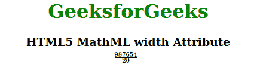

# HTML5 MathML 宽度属性

> 原文:[https://www.geeksforgeeks.org/html5-mathml-width-attribute/](https://www.geeksforgeeks.org/html5-mathml-width-attribute/)

该属性用于设置内容的宽度或增加/减少内容的宽度。该属性被 [< mglyph >](https://www.geeksforgeeks.org/html5-mathml-mglyph-tag/) 、 [< mpadded >](https://www.geeksforgeeks.org/html5-mathml-mpadded-tag/) 、 [< mspace >](https://www.geeksforgeeks.org/html5-mathml-mspace-tag/) 和 [< mtable >](https://www.geeksforgeeks.org/html5-mathml-mtable-tag/) 标签接受。

**语法:**

```html
<element width="length">
```

**属性值:**

*   **长度:**以特定单位保存数字，将定义多少宽度。

下面的例子说明了 HTML5 中的宽度:

**示例:**

## 超文本标记语言

```html
<!DOCTYPE html>
<html>

<head>
    <title>HTML5 MathML width Attribute</title>
</head>

<body style="text-align:center;">

    <h1 style="color:green">
        GeeksforGeeks
    </h1>

    <h3>HTML5 MathML width Attribute</h3>

    <math>
        <mrow>
            <mpadded lspace="2em" voffset="1em" 
                height="1em" depth="3em" width="7em">

                <mfrac>
                    <mn>987654</mn>
                    <mn>20</mn>
                </mfrac>
            </mpadded>
        </mrow>
    </math>
</body>

</html> 
```

**输出:**



**支持的浏览器:**宽度属性支持的浏览器如下:

*   火狐浏览器