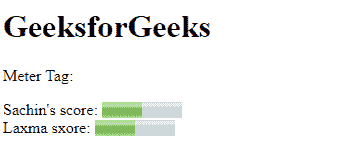

# HTML5 <meter>标签</meter>

> 原文:[https://www.geeksforgeeks.org/html5-meter-tag/](https://www.geeksforgeeks.org/html5-meter-tag/)

它用于在明确定义的范围内定义测量刻度，还支持小数值。它也被称为标尺。它用于磁盘使用、相关性查询结果等。

**语法:**

```html
<meter attributes...> </meter>
```

**属性:**该标签包含许多属性，如下所示:

*   [**表单**](https://www.geeksforgeeks.org/html-meter-form-attribute/#:~:text=The%20HTML%20form%20Attribute,contain%20one%20or%20more%20forms.&text=Attribute%20Values%3A%20It%20contains%20single,to%20the%20element.) **:** 它也定义了仪表标签所属的一个或多个表单。
*   [**max**](https://www.geeksforgeeks.org/html-meter-max-attribute/) **:** 用于指定一个范围的最大值。
*   [**min**](https://www.geeksforgeeks.org/html-meter-min-attribute/) **:** 用于指定一个范围的最小值。
*   [**高**](https://www.geeksforgeeks.org/html-meter-high-attribute/) **:用于指定被认为是高值的范围。**
*   [**低**](https://www.geeksforgeeks.org/html-meter-low-attribute/) **:用于指定被认为是低的范围值。**
*   [**【最优】**](https://www.geeksforgeeks.org/html-meter-optimum-attribute/#:~:text=HTML%20%7C%20optimum%20Attribute,-Last%20Updated%20%3A%2019&text=The%20HTML%20optimum%20Attribute,the%20range%20is%20considered%20preferable.) **:用于指定区间的最优值。**
*   [**值**](https://www.geeksforgeeks.org/html-meter-value-attribute/) **:** 用于指定范围的要求值或实际值。

**示例:**

## 超文本标记语言

```html
<!DOCTYPE html>
<html>
    <body>
        <h1>GeeksforGeeks</h1>

<p>Meter Tag:</p>

        Sachin's score:
        <meter value="5" min="0" max="10">
          5 out of 10
        </meter>
        <br>
        Laxma sxore:
        <meter value="0.5">
          50% from 100%
        </meter>
    </body>
</html>                                           
```

**输出:**



**支持的浏览器:**

*   谷歌 Chrome 8.0
*   Internet Explorer 13.0
*   Firefox 6.0
*   Opera 11.0
*   Safari 6.0

**重要提示:**仪表标签不应用于指示进度(如在进度条中)。对于进度条，使用[进度](https://www.geeksforgeeks.org/html-5-progress-tag/)标签。