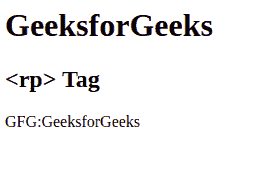

# HTML5 rp 标记

> 哎哎哎:# t0]https://www . geeksforgeeks . org/html 5-RP 标签/

HTML 中的<rp>标记用于在定义信息的 ruby 主文本周围提供圆括号。当浏览器不支持 ruby 注释时，使用这个标记。这种注释在日本出版物中使用。这是一个可选标签。该标签用于<ruby>标签内。这个标签在 HTML5 中是新的。
**语法:**</ruby></rp> 

```html
<rt><rp>[</rp> Explaination... <rp>]</rp></rt>
```

**例:**

## 超文本标记语言

```html
<!DOCTYPE html>

<html>

        <body>
            <h1>GeeksforGeeks</h1>
            <h2><rp> Tag</h2>
            <ruby>GFG:
                <rt>
                    <!-- HTML rp tag starts here -->
                    <rp>[</rp>GeeksforGeeks
                    <rp>]</rp>
                     <!-- HTML rp tag starts here -->
                </rt>
            </ruby>
        </body>

</html>                   
```

**输出:**



**支持的浏览器:**

*   谷歌 Chrome 5.0
*   Internet Explorer 5.5
*   Firefox 38.0
*   Opera 15.0
*   Safari 5.0