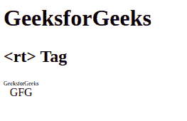
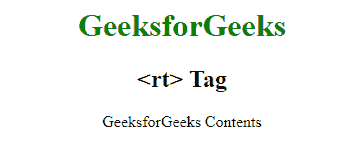

# HTML5 rt 标签

> 原文:[https://www.geeksforgeeks.org/html5-rt-tag/](https://www.geeksforgeeks.org/html5-rt-tag/)

HTML 中的<rt>标签用于定义 ruby 注释的解释，是一个小文本，附带主文本。这种注释在日本出版物中使用。这个标签在 HTML5 中是新的。
**语法:**</rt> 

```
<rt> Explaination... </rt>
```

**示例 1:** 本示例描述了<红宝石>标签中的< rt >标签。

## 超文本标记语言

```
<!DOCTYPE html>
<html>

        <body>

        <h1>GeeksforGeeks</h1>
        <h2><rt> Tag</h2>
        <ruby>
            <!-- html rt tag is used here -->
            GFG<rt>GeeksforGeeks</rt>
        </ruby>

        </body>

</html>
```

**输出:**



**例 2:** 本例不包含<红宝石>标签。

## 超文本标记语言

```
<!DOCTYPE html>
<html>
    <head>
        <title>rt tag</title>
        <style>
            body {
                text-align:center;
            }
            h1 {
                color:green;
            }
        </style>
    </head>
    <body>
        <h1>GeeksforGeeks</h1>
        <h2><rt> Tag</h2>
        <rt>GeeksforGeeks Contents</rt>
    </body>
</html>                   
```

**输出:**



**支持的浏览器:**

*   谷歌 Chrome 5.0
*   Internet Explorer 5.5
*   Firefox 38.0
*   Opera 15.0
*   Safari 5.0