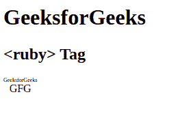

# HTML5 <ruby>标签</ruby>

> 原文:[https://www.geeksforgeeks.org/html5-ruby-tag/](https://www.geeksforgeeks.org/html5-ruby-tag/)

HTML 中的<ruby>标记用于指定 ruby 注释，它是一个小文本，与主文本一起附加，以指定主文本的含义。这种注释在日本出版物中使用。
**语法:**</ruby> 

```html
<ruby attributes> Contents... </ruby>
```

**注意:** <红宝石>标签包含另外两个标签，如下所示:

*   [**<rt>tag**](https://www.geeksforgeeks.org/html5-rt-tag/)**:**用来描述主文在主文之上的解释。
*   [**< rp >标签**](https://www.geeksforgeeks.org/html5-rp-tag/) **:** 可选，用于指定浏览器不支持 ruby 标注时需要显示的信息。

**例:**

## 超文本标记语言

```html
<!DOCTYPE html>
<html>

        <body>

            <h1>GeeksforGeeks</h1>
            <h2><ruby> Tag</h2>
            <!-- html ruby tag is used here -->
            <ruby>GFG<rt>GeeksforGeeks</rt></ruby>

        </body>

</html>
```

**输出:**



**支持的浏览器:**

*   谷歌 Chrome 5.0
*   Internet Explorer 5.5
*   Firefox 38.0
*   Opera 15.0
*   Safari 5.0