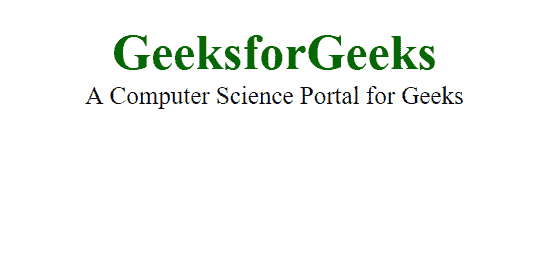
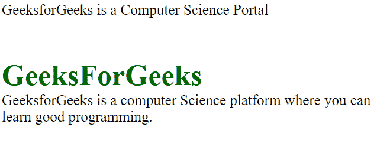
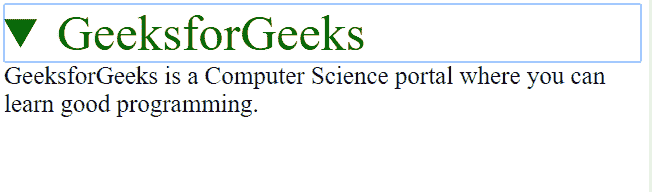
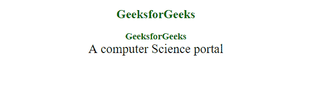
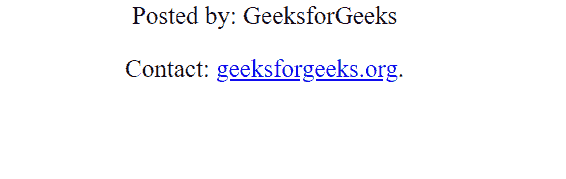
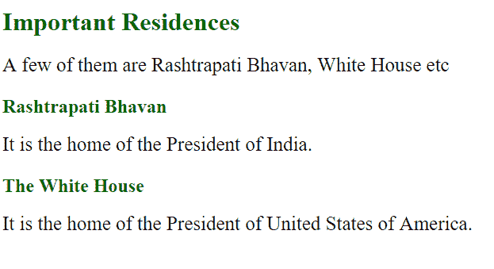
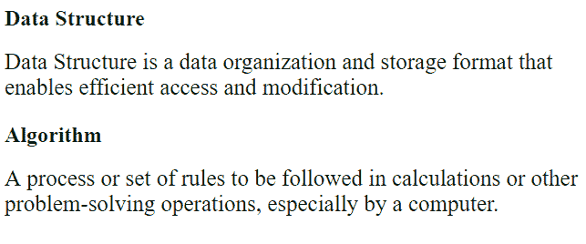
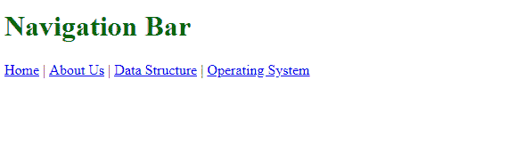
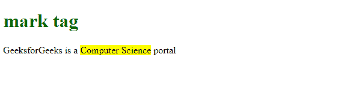
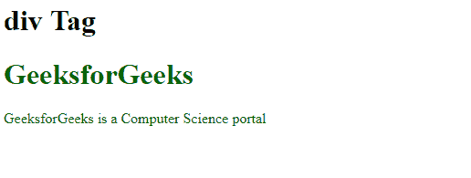

# HTML5 |语义

> 原文:[https://www.geeksforgeeks.org/html5-semantics/](https://www.geeksforgeeks.org/html5-semantics/)

HTML 标签分为两种类型。

*   语义的
*   非语义的

**语义元素:**语义元素有有意义的名称，可以说明内容的类型。例如页眉、页脚、表格等。HTML5 引入了许多语义元素，如下所述，这些元素使开发人员更容易编写和理解代码，并指导浏览器如何对待它们。

*   文章
*   在旁边
*   细节
*   figcaption(快照标题)
*   数字
*   页脚
*   页眉
*   主要的
*   标记
*   航行
*   部分

**文章:**包含独立内容，不需要任何其他上下文。
例子:博文、报纸文章等。

## 超文本标记语言

```html
<!DOCTYPE html>
<html>
   <head>
      <title>Article Tag</title>
      <style>
         h1 {
         Color:#006400;
         font-size:50px;
         Text-align:left;
         }
         p {
         font-size:25px;
         text-align:left;
         margin-top:-40px;
         }
      </style>
   </head>
   <body>
      <article>
         <h1>GeeksforGeeks</h1>

<p>A Computer Science Portal for Geeks</p>

      </article>
   </body>
</html>
```

**输出:**



**旁白:**用于将内容放在侧边栏中，即放在现有内容的旁边。它与周围的内容有关。

## 超文本标记语言

```html
<!DOCTYPE html>
<html>
   <head>
      <title>Aside Tag</title>
      <style>
         h4 {
         Color:#006400;
         font-size:50px;
         Text-align:none;
         margin-bottom:0px;
         }
         p {
         font-size:25px;
         text-align:none;
         margin-top:0px;
         }
      </style>
   </head>
   <body>

<p>GeeksforGeeks is a Computer Science Portal</p>

      <aside>
         <h4>GeeksForGeeks</h4>

<p>GeeksforGeeks is a computer Science platform
            where you can learn good programming.
         </p>

      </aside>
   </body>
</html>
```

**输出:**



**详细信息和摘要:**“详细信息”定义了用户可以隐藏或查看的附加详细信息。“摘要”为“细节”元素定义了一个可见的标题。

## 超文本标记语言

```html
<!DOCTYPE html>
<html>
   <head>
      <title>Detail and summary Tag</title>
      <style>
         .GFG {
         Color:#006400;
         font-size:50px;
         Text-align:none;
         margin-bottom:0px;
         }
         p {
         font-size:25px;
         text-align:none;
         margin-top:0px;
         }
      </style>
   </head>
   <body>
      <details>
         <summary class="GFG">GeeksforGeeks</summary>

<p>GeeksforGeeks is a Computer Science portal
            where you can learn good programming.
         </p>

      </details>
   </body>
</html>
```

**输出:**



**图和图标题:**这些是用来在网页中添加一个小描述的图片。

## 超文本标记语言

```html
<!DOCTYPE html>
<html>
   <head>
      <title>Figcaption Tag</title>
      <style>
         h2 {
         Color:#006400;
         font-size:50px;
         Text-align:none;
         margin-bottom:0px;
         }
         p {
         font-size:25px;
         text-align:none;
         margin-top:0px;
         }
      </style>
   </head>
   <body>
      <h2>GeeksforGeeks</h2>
      <figure>
         
         <figcaption>GeeksforGeeks Logo</figcaption>
      </figure>
   </body>
</html>
```

**输出:**


**页眉:**顾名思义，是针对一页的一个介绍性章节的页眉。一页可以有多个标题。

## 超文本标记语言

```html
<!DOCTYPE html>
<html>
   <head>
      <title>Header Tag</title>
      <style>
         h1, h3 {
         Color:#006400;
         Text-align:left;
         margin-bottom:0px;
         }
         p {
         font-size:25px;
         text-align:left;
         margin-top:0px;
         }
      </style>
   </head>
   <body>
      <article>
         <header>
            <h1>GeeksforGeeks</h1>
            <h3>GeeksforGeeks</h3>

<p>A computer Science portal</p>

         </header>
      </article>
   </body>
</html>
```

**输出:**



**页脚:**页脚位于任何文章或文档的底部，它们可以包含联系方式、版权信息等。一页可以有多个页脚。

## 超文本标记语言

```html
<!DOCTYPE html>
<html>
   <head>
      <title>footer Tag</title>
      <style>
         p {
         font-size:25px;
         text-align:left;
         margin-top:0px;
         }
      </style>
   </head>
   <body>
      <footer>

<p>Posted by: GeeksforGeeks</p>

<p>Contact: <a href="https://www.geeksforgeeks.org">
            geeksforgeeks.org</a>.
         </p>

      </footer>
   </body>
</html>
```

**输出:**



**Main:** 定义文档的主要内容。主标签中的内容应该是唯一的。

## 超文本标记语言

```html
<!DOCTYPE html>
<html>
   <head>
      <title>main Tag</title>
      <style>
         h1 {
         color:#006400;
         }
         p {
         font-size:25px;
         text-align:none;
         margin-top:0px;
         }
      </style>
   </head>
   <body>
      <main>
         <h1>Important Residences</h1>

<p>A few of them are Rashtrapati Bhavan, White House etc</p>

         <article>
            <h1>Rashtrapati Bhavan</h1>

<p>It is the home of the President of India.</p>

         </article>
         <article>
            <h1>The White House</h1>

<p>It is the home of the President of United
               States of America.
            </p>

         </article>
      </main>
   </body>
</html>
```

**输出:**



**部分:**一个页面可以分成几个部分，如简介、联系信息、详细信息等，每个部分都可以在不同的部分标签中。

## 超文本标记语言

```html
<!DOCTYPE html>
<html>
   <head>
      <title>section Tag</title>
      <style>
         h1 {
         color:#006400;
         }
         p {
         font-size:25px;
         text-align:none;
         margin-top:0px;
         }
      </style>
   </head>
   <body>
      <section>
         <h1>Data Structure</h1>

<p>Data Structure is a data organization and
            storage format that enables efficient access
            and modification.
         </p>

      </section>
      <section>
         <h1>Algorithm</h1>

<p>A process or set of rules to be followed
            in calculations or other problem-solving
            operations, especially by a computer.
         </p>

      </section>
   </body>
</html>
```

**输出:**



**导航:**用于以导航栏或导航菜单的形式定义一组导航链接。

## 超文本标记语言

```html
<!DOCTYPE html>
<html>
   <head>
      <title>nav Tag</title>
      <style>
         h1 {
         color:#006400;
         }
      </style>
   </head>
   <body>
      <h1>Navigation Bar</h1>
      <nav>
         <a href="/home/">Home</a> |
         <a href="/about-us/">About Us</a> |
         <a href="/data-structure/">Data Structure</a> |
         <a href="/operating-system/">Operating System</a>
      </nav>
   </body>
</html>
```

**输出:**



**标记:**用于突出显示文本。

## 超文本标记语言

```html
<!DOCTYPE html>
<html>
   <head>
      <title>mark Tag</title>
      <style>
         h1 {
         color:#006400;
         }
      </style>
   </head>
   <body>
      <h1>mark tag</h1>

<p>GeeksforGeeks is a <mark>Computer Science</mark> portal</p>

   </body>
</html>
```

**输出:**



**非语义元素:**像 div、span 这样的标签属于非语义类别，因为它们的名称不能说明它们内部存在什么样的内容。
它被用作容器。

## 超文本标记语言

```html
<!DOCTYPE html>
<html>
   <head>
      <title>div Tag</title>
      <style>
         .GFG {
         color:#006400;
         }
      </style>
   </head>
   <body>
      <h1>div Tag</h1>
      <div class="GFG">
         <h1>GeeksforGeeks</h1>

<p>GeeksforGeeks is a Computer Science portal</p>

      </div>
   </body>
</html>
```

**输出:**



**span:** 它是一个内联元素，不从一个新行开始，只占用必要的宽度。更多详情请使用[https://www.geeksforgeeks.org/span-tag-html/](https://www.geeksforgeeks.org/span-tag-html/)。

**支持的浏览器:**

*   谷歌 Chrome 6.0 及以上版本
*   Internet Explorer 9.0 及以上版本
*   Mozilla 4.0 及以上版本
*   Opera 11.1 及以上
*   Safari 5.0 及以上版本