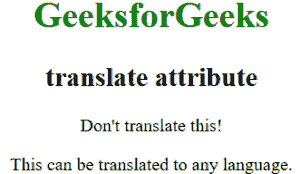

# HTML5 |翻译属性

> 原文:[https://www.geeksforgeeks.org/html5-translate-attribute/](https://www.geeksforgeeks.org/html5-translate-attribute/)

HTML 中的 translate 属性用于指定元素的内容是否被翻译。这个属性在 HTML5 中是新的。
**支持的标签:**支持所有 HTML 元素。

**语法:**

```html
<element translate = "yes|no">
```

**属性值:**翻译属性包含两个值，如下所示:

*   **是:**该属性用于指定元素的内容可以翻译。
*   **否:**此属性用于指定元素的内容不能翻译。

**例:**

## 超文本标记语言

```html
<!DOCTYPE html>
<html>
    <head>
        <title>translate attribute</title>
        <style>
            body {
                text-align:center;
            }
            h1 {
                color:green;
            }
        </style>
    </head>
    <body>
        <h1>GeeksforGeeks</h1>
        <h2><strong >translate attribute</strong></h2>
        <p translate="no">Don't translate this!</p>

<p>This can be translated to any language.</p>

    </body>
</html>
```

**输出:**



**支持的浏览器:**翻译属性不支持主要浏览器。