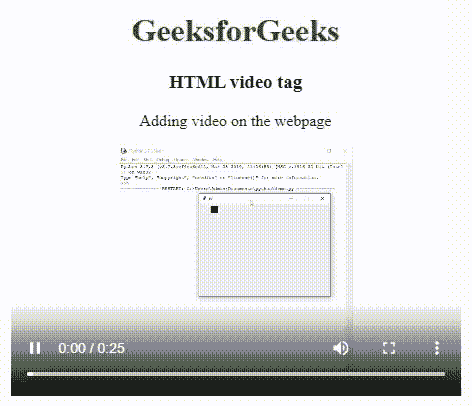
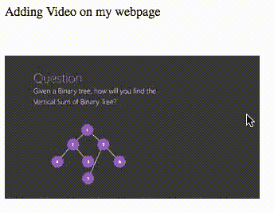
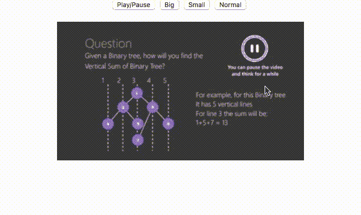

# HTML5 视频

> 原文:[https://www.geeksforgeeks.org/html5-video/](https://www.geeksforgeeks.org/html5-video/)

**示例:**这个示例说明了<视频>标签的使用，其中我们使用了 preload 属性，该属性的值设置为 auto，指定了当页面加载时浏览器应该加载整个视频。

## 超文本标记语言

```html
<!DOCTYPE html>
<html>
<body>
    <center>
        <h1 style="color:green;">GeeksforGeeks</h1>
        <h3>HTML video tag</h3>

<p>Adding video on the webpage

<p>
                <video width="450"
                       height="250"
                       controls
                       preload="auto">
                    <source src=
"https://media.geeksforgeeks.org/wp-content/uploads/20190616234019/Canvas.move_.mp4"
                       type="video/mp4">
                    <source src=
"https://media.geeksforgeeks.org/wp-content/uploads/20190616234019/Canvas.move_.ogg"
                       type="video/ogg">
                </video>
    </center>
</body>
</html>
```

**输出:**



在 HTML 5 出现之前，视频只能使用 flash 这样的插件在浏览器中播放。但是 HTML 5 发布后，在网页中添加视频就像添加图像一样简单。HTML5“视频”元素指定了在网页上嵌入视频的标准方式。

网络浏览器通常支持三种不同的格式——MP4、Ogg 和 WebM。下表列出了不同浏览器支持的格式:

<figure class="table">T21T34

| 

#### Browser

 | 

#### MP4

 | 

#### 网页

 | 

#### OGG

 |
| --- | --- | --- | --- |
| 谷歌铬 | 是 | 是 | 是 |
| opera | be | be | be |
| hunt | be | be | no |

</figure>

**语法:**

```html
 <video src="" controls>   </video>
```

**可用于“视频”标签的属性如下:**

1.  [**【自动播放】**](https://www.geeksforgeeks.org/html-video-autoplay-attribute/) **:它告诉浏览器立即开始下载视频，并尽快播放。**
2.  [**Preload**](https://www.geeksforgeeks.org/html-video-preload-attribute/) **:** 它旨在向浏览器提供一个提示，提示作者认为什么会带来最好的用户体验。
3.  [**循环**](https://www.geeksforgeeks.org/html-video-loop-attribute/) **:它告诉浏览器自动循环播放视频。**
4.  [**高度**](https://www.geeksforgeeks.org/html-video-height-attribute-2/) **:** 设置视频的高度，以 CSS 像素为单位。
5.  [**宽度**](https://www.geeksforgeeks.org/html-video-width-attribute/) **:** 设置视频的宽度，以 CSS 像素为单位。
6.  [**控件:**](https://www.geeksforgeeks.org/html-video-controls-attribute/) 显示播放、暂停、音量等默认视频控件。
7.  [**静音**](https://www.geeksforgeeks.org/html-video-muted-attribute/) **:** 静音视频中的音频。
8.  [**海报**](https://www.geeksforgeeks.org/html-video-poster-attribute/) **:** 它会在加载视频之前加载一个图像进行预览。

**使用 HTML5 添加视频:**

**示例:**这个简单的示例说明了<视频>标签在 HTML 中的使用。这里，*控件*属性用于添加播放、暂停、音量等控件，&元素用于指定浏览器将选择播放的视频。

## 超文本标记语言

```html
<!DOCTYPE html>
<html>
<body>

<p>Adding Video on my webpage </p>

    <video width="400"
           height="350"
           controls>
        <source src="myvid.mp4"
                type="video/mp4">
        <source src="myvid.ogg"
                type="video/ogg">
    </video>
</body>
</html>
```

**输出:**



视频添加到 HTML。

**使用 HTML5 自动播放视频:**为了自动开始播放视频，我们可以使用自动播放属性。

**示例:**该示例说明了 HTML <视频>标签中自动播放属性的使用。

## 超文本标记语言

```html
<!DOCTYPE html>
<html>
<body>

<p>Adding Video on my webpage</p>

    <video width="400"
           height="350"
           autoplay>
        <source src="myvid.mp4" type="video/mp4">
        <source src="myvid.ogg" type="video/ogg">
    </video>
</body>
</html>
```

**输出:**


自动播放属性

**使用 JavaScript 的 HTML 视频:**可以为视频设置许多属性和事件，如加载、播放和暂停视频，以及设置持续时间和音量。

**示例:**在这个示例中，我们使用了 Javascript，以便在 HTML 中播放、暂停&设置视频的音量&持续时间。

## 超文本标记语言

```html
<!DOCTYPE html>
<html>
<body>
    <div style="text-align:center">
        <button onclick="Pauseplay()">Pause/Play</button>
        <button onclick="Big()">Big</button>
        <button onclick="Small()">Small</button>
        <button onclick="Normal()">Normal</button>
        <br>
        <video id="myvideo" width="450">
            <source src="myvid.MP4"
                    type="video/mp4">
            <source src="myvid.ogg"
                    type="video/ogg">
        </video>
    </div>
    <script>
        var testvideo = document.getElementById("myvideo");

        function Pauseplay() {
            if(testvideo.paused) testvideo.play();
            else testvideo.pause();
        }

        function Big() {
            testvideo.width = 600;
        }

        function Small() {
            testvideo.width = 300;
        }

        function Normal() {
            testvideo.width = 450;
        }
    </script>
</body>
</html>
```

**输出:**



**支持的浏览器:**

*   谷歌 Chrome 93.0
*   Internet Explorer 11.0
*   微软边缘 93.0
*   Firefox 92.0
*   Opera 79.0
*   Safari 14.1