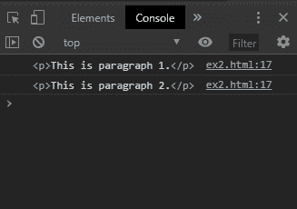
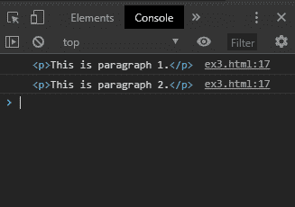

# 循环的 HTMLCollection】

> 原文:[https://www.geeksforgeeks.org/htmlcollection-for-loop/](https://www.geeksforgeeks.org/htmlcollection-for-loop/)

不建议使用 for/in 循环来遍历 HTMLCollection，因为这种类型的循环用于遍历对象的属性。HTMLCollection 包含可能与所需元素一起返回的其他属性。

有 3 种方法可以用来在 HTMLCollection 中正确循环。

*   **Method 1: Using the for/of loop:** The for/of loop is used to loop over values of an iterable object. This includes arrays, strings, nodeLists, and HTMLCollections.

    此循环的语法类似于 for/in 循环。该对象必须可迭代才能用于此循环。

    **语法:**

    ```
    for (item of iterable) {
      // code to be executed
    }
    ```

    **示例:**

    ```
    <!DOCTYPE html>
    <html>

    <head>
        <title>For loop for HTMLCollection elements</title>
    </head>

    <body>
        <h1 style="color: green">GeeksforGeeks</h1>
        <b>For loop for HTMLCollection elements</b>
        <p>This is paragraph 1.</p>
        <p>This is paragraph 2.</p>
        <script type="text/javascript">
            // get a HTMLCollection of elements in the page
            let collection = document.getElementsByTagName("p");

            // regular for loop
            for (let i = 0; i < collection.length; i++) {
                console.log(collection[i]);
            }
        </script>
    </body>

    </html>
    ```

    **控制台输出:**
    

*   **Method 2: Using the Array.from() method to convert the HTMLCollection to an Array**
    The Array.from() method is used to create a new Array from an array-like or iterable object. The HTMLCollection is passed to this method to convert it into an Array.

    forEach()方法现在可以用来像数组一样迭代元素并显示它们。

    **语法:**

    ```
    Array.from(collection).forEach(function (element) {
            console.log(element)
          });
    ```

    **示例:**

    ```
    <!DOCTYPE html>
    <html>

    <head>
        <title>For loop for HTMLCollection elements</title>
    </head>

    <body>
        <h1 style="color: green">GeeksforGeeks</h1>
        <b>For loop for HTMLCollection elements</b>
        <p>This is paragraph 1.</p>
        <p>This is paragraph 2.</p>
        <script type="text/javascript">
            // get a HTMLCollection of elements in the page
            let collection = document.getElementsByTagName("p");

            // convert to an array using Array.from()
            Array.from(collection).forEach(function(element) {
                console.log(element)
            });
        </script>
    </body>

    </html>
    ```

    **输出:**
    

*   **Method 3: Using a normal for loop**
    The elements can be iterated through by using a normal for loop. The number of elements in the HTMLCollection can be found out by using the length property of the collection. A for loop is then run to the number of elements.

    每个项目都可以通过使用带有各自索引的方括号来访问。

    **语法:**

    ```
    for (let i = 0; i < collection.length; i++) {
            console.log(collection[i]);
          }
    ```

    **示例:**

    ```
    <!DOCTYPE html>
    <html>

    <head>
        <title>For loop for HTMLCollection elements</title>
    </head>

    <body>
        <h1 style="color: green">GeeksforGeeks</h1>
        <b>For loop for HTMLCollection elements</b>
        <p>This is paragraph 1.</p>
        <p>This is paragraph 2.</p>
        <script type="text/javascript">
            // get a HTMLCollection of elements in the page
            let collection = document.getElementsByTagName("p");

            // convert to an array using Array.from()
            Array.from(collection).forEach(function(element) {
                console.log(element)
            });
        </script>
    </body>

    </html>
    ```

    **输出:**
    