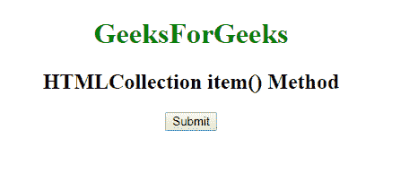
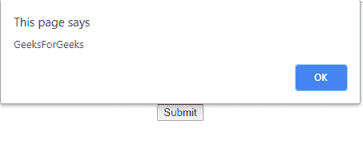
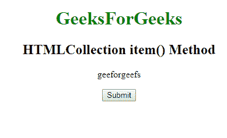
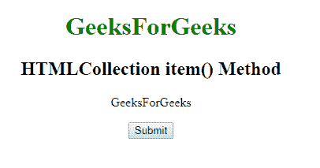

# HTMLCollection 项()方法

> 原文:[https://www.geeksforgeeks.org/htmlcollection-item-method/](https://www.geeksforgeeks.org/htmlcollection-item-method/)

**item()方法**用于返回所有 HTML 元素集合中给定索引处的元素内容。索引从零(0)开始。集合中的元素按照它们在源代码中出现的顺序进行排序。

**语法:**

```html
HTMLCollection.item(index) 
```

**或**

```html
HTMLCollection[index] 
```

**参数:**包含一个数字，代表用户想要返回的元素的索引。索引从 0 开始。

**示例-1:**

```html
<!DOCTYPE html>
<html>

<head>
    <style>
        h1 {
            color: green;
        }
    </style>
</head>

<body>
    <center>
        <h1>GeeksForGeeks</h1>
        <h2>HTMLCollection item() Method</h2>

        <button onclick="Geeks()">Submit</button>

        <script>
            function Geeks() {
                var w = document.getElementsByTagName("h1");
                alert(w.item(0).innerHTML);
            }
        </script>

</body>

</html>
```

**输出:**
**点击按钮前:**

**点击按钮后:**


**示例-2:** 更改 HTML 元素的内容。

```html
<!DOCTYPE html>
<html>

<head>
    <style>
        h1 {
            color: green;
        }
    </style>
</head>

<body>
    <center>
        <h1>GeeksForGeeks</h1>
        <h2>HTMLCollection item() Method</h2>
        <p>geeforgeefs</p>
        <button onclick="Geeks()">Submit</button>

        <script>
            function Geeks() {
                document.getElementsByTagName("P")[0].innerHTML = 
                                                  "GeeksForGeeks";
            }
        </script>

</body>

</html>
```

**输出:**
**点击按钮前:**

**点击按钮后:**


**支持的浏览器:**html collection item()方法支持的浏览器如下:

*   谷歌 Chrome
*   微软公司出品的 web 浏览器
*   火狐浏览器
*   歌剧
*   旅行队