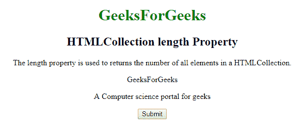
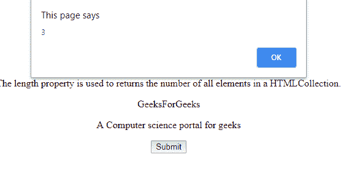
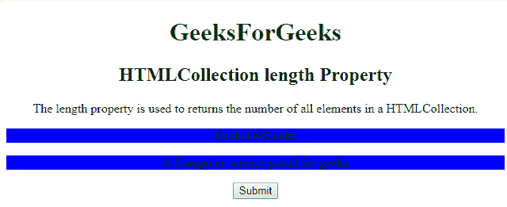

# HTMLCollection 长度属性

> 原文:[https://www . geesforgeks . org/html collection-length-property/](https://www.geeksforgeeks.org/htmlcollection-length-property/)

**length()** 属性用于返回文档中所有 HTML 元素的集合。它是只读属性，当用户想要遍历 HTML 集合时非常有用。

**语法:**

```html
HTMLCollection.length 

```

**返回值:**返回一个数字，代表一个 HTML 集合中所有元素的数量。

**下面的例子展示了如何计算 html 集合中的所有< p >元素:**

**示例-1:**

## 超文本标记语言

```html
<!DOCTYPE html>
<html>

<head>
    <style>
        h1 {
            color: green;
        }
    </style>
</head>

<body>
    <center>
        <h1>GeeksForGeeks</h1>
        <h2>
          HTMLCollection length Property
        </h2>

<p>
          The length property is used to return the
          number of all elements in a HTMLCollection.
        </p>

        <div>

<p>GeeksForGeeks</p>

<p>A Computer science portal for geeks</p>

        </div>

        <button onclick="Geeks()">Submit</button>

        <!-- l is the HTML collection here -->
        <script>
            function Geeks() {
                var l =
                    document.getElementsByTagName("P").length;
                alert(l);
            }
        </script>
  </center>

</body>

</html>
```

**输出:**
**点击按钮前:**



**点击按钮后:**



**示例-2:** 使用长度属性高亮显示 GFG 类的所有元素。

## 超文本标记语言

```html
<!DOCTYPE html>
<html>

<head>
    <style>
        h1 {
            color: green;
        }
    </style>
</head>

<body>
    <center>
        <h1>GeeksForGeeks</h1>
        <h2>HTMLCollection length Property</h2>

<p>
          The length property is used to return the
          number of all elements in a HTMLCollection.
         </p>

        <div>
            <p class="GFG">GeeksForGeeks</p>

            <p class="GFG">
              A Computer science portal for geeks
            </p>

        </div>

        <button onclick="Geeks()">Submit</button>

        <!-- w is the HTML collection here -->
        <script>
            function Geeks() {
                var w, c;

                w = document.getElementsByClassName("GFG");
                for (c = 0; c < w.length; c++) {
                    w[c].style.backgroundColor = "BLUE";
                }
            }
        </script>
  </center>

</body>

</html>
```

**输出:**
**点击按钮前:**


**点击按钮后:**



**支持的浏览器:**html collection length 属性支持的浏览器如下:

*   谷歌 Chrome
*   微软公司出品的 web 浏览器
*   火狐浏览器
*   歌剧
*   旅行队