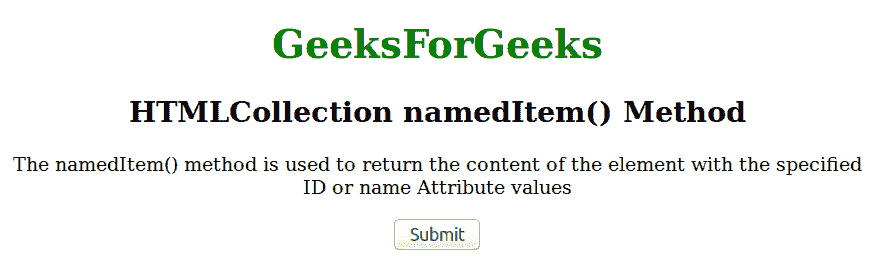
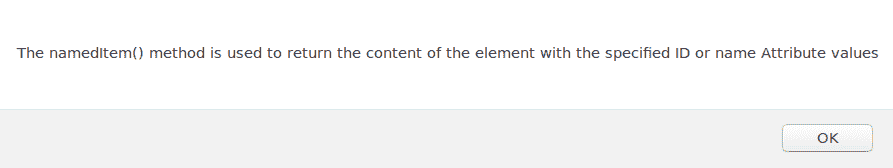

# HTMLCollection namedItem()方法

> 原文:[https://www . geesforgeks . org/html collection-named item-method/](https://www.geeksforgeeks.org/htmlcollection-nameditem-method/)

**namedItem()** 方法用于返回文档中 HTML 元素集合中具有指定 ID、OR、名称或内容的元素。
**语法:**

```html
HTMLCollection.namedItem(name)
```

**或**T2

```html
HTMLCollection[name]
```

**参数:**它包含名称作为参数值，代表用户想要返回的标识或名称属性。
**返回值:**返回一个 Element 对象，代表指定 ID 或名称的元素。否则，如果元素不存在，它将返回 null。

**例:**

## 超文本标记语言

```html
<!DOCTYPE html>
<html>

<head>
    <style>
        h1 {
            color: green;
        }
    </style>
</head>

<body>
    <center>
        <h1>GeeksForGeeks</h1>
        <h2>HTMLCollection namedItem() Method</h2>

        <p id="GFG">
          The namedItem() method is used to return
          the content of the element with the specified
          ID or name Attribute values
        </p>

        <button onclick="Geeks()">Submit</button>

        <script>
            function Geeks() {
                var w =
                    document.getElementsByTagName("P").namedItem("GFG");
                alert(w.innerHTML);
            }
        </script>
    </center>
</body>

</html>
```

**输出:**



点击提交后:



**支持的浏览器:**html collection NAMEDitem()方法支持的浏览器如下:

*   谷歌 Chrome
*   微软公司出品的 web 浏览器
*   火狐浏览器
*   歌剧
*   旅行队