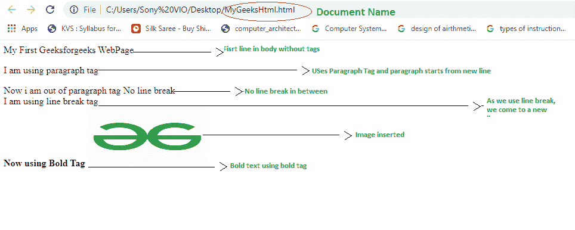
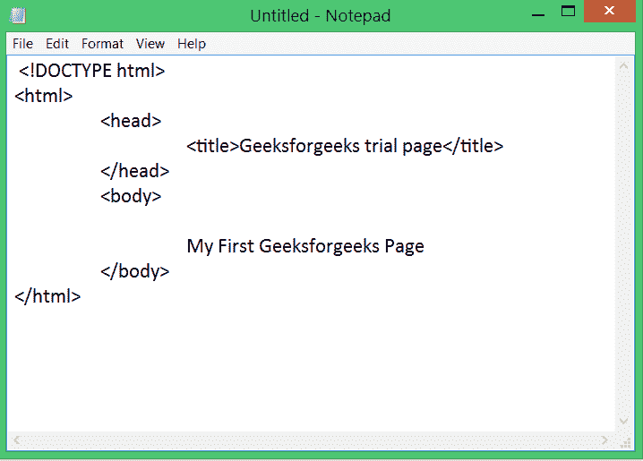
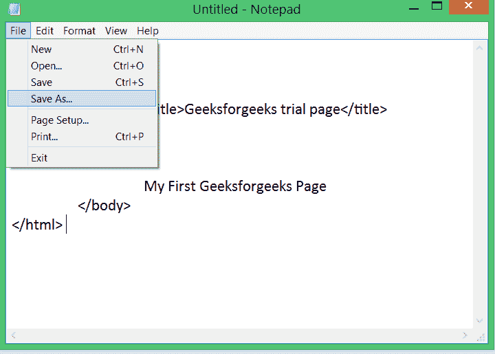
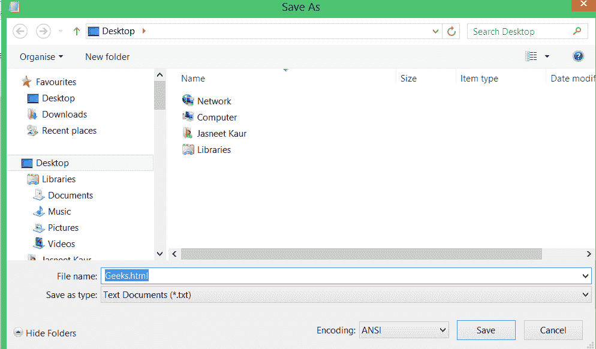
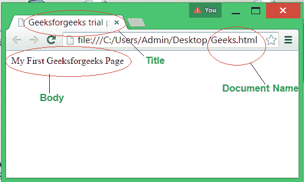

# HTML 简介

> 原文:[https://www.geeksforgeeks.org/introduction-to-html/](https://www.geeksforgeeks.org/introduction-to-html/)

HTML 代表超文本标记语言。它是最基本的语言，学习和修改都很简单。它是超文本和标记语言的结合。它包含可以改变/发展网页外观和显示内容的元素。或者我们可以说，HTML 创建或定义了网页的结构。我们可以使用 HTML 创建网站，这些网站可以在笔记本电脑、安卓手机等联网设备上查看。它是蒂姆·伯纳斯·李在 1991 年创造的。HTML 的第一个版本是 1999 年发布的 HTML 2.0，最新版本是 HTML 5。我们可以保存扩展名为. html 的 HTML 文件

**什么是超文本？**

不受限于顺序格式的文本，包括到其他文本的链接，称为超文本。这些链接可以连接单个或不同网站内的在线页面。

**什么是标记语言？**

标记语言是一种由浏览器解释的语言，它使用“标签”定义文档中的元素。它是人类可读的，这意味着标记文件使用常见的单词，而不是复杂的编程语言语法。

**为什么要用 HTML？**

如果你想从事网络开发，HTML 是你应该学习的第一语言。HTML 是一种快速加载的标记语言&也是轻量级的。每当您使用浏览器联系服务器时，都会收到 HTML 和 CSS 形式的响应。HTML 支持许多标签，使您的网页更具吸引力和可识别性。HTML5 最近加入了新的标签和元素，以帮助开发专业外观的网页。

### 什么是 HTML 中的标签和元素？

**HTML 标签:** HTML 标签是指定数据将如何显示或网络浏览器如何格式化数据的特殊关键字。有了标签，网络浏览器可以在文档中搞清楚:什么是 HTML 内容，什么是正常的普通内容(因为标签总是写在尖括号< >)。通常，标签的开始由角括号< >给出，结束由角括号和/即< / >给出

**示例:**

```html
<head></head>
```

**HTML 元素:** T 开始标签和结束标签的集合以及插入其中的内容被称为元素标签。

**示例:**

```html
<head> I am HTML element </head>
```

**重要 HTML 标签:**

*   **<！文档类型 html > :** 定义文档的类型。这里它定义了文档类型是 html。
*   **<html></html>:**它是根元素，所有其他标签都包含在其中。它决定了 HTML 文档的开始和结束。
*   **<头像></头像> :** 它包含了 HTML 文档的元数据&实际上并没有显示在网页上。标题以<头>开始，以</头>结束。
*   **<标题></标题> :** 用于创建文档的标题，标题出现在顶部的标题栏中。每个文档中至少出现一个标题。文档的标题部分以<标题>开始，以</标题>结束，在两者之间，输入您想要作为标题的文本。
*   **<正文></正文> :** 包含要在网页上显示的文档内容。内容可以是图像、一些文本、一些链接等。这部分代表 web 文档的主体，通常包括标题、文本和段落。
*   **< p > :** 用于定义段落。
*   **< br > :** 用于单线断线。
*   **< img > :** 用于定义给定来源的图像。
*   **< sup > :** 用于定义上标数据。
*   **< b > :** 用于定义粗体文本。
*   **<子> :** 用于定义下标数据等。

**例:**保存 MyGeeksHtml.html 的以下内容

## 超文本标记语言

```html
<!DOCTYPE html>
<html>

    <head>
        <title> Geeksforgeeks webpage</title>
    </head>

    <body>

        My First Geeksforgeeks WebPage

<p> I am using paragraph tag </p>

        Now i am out of paragraph tag

        No line break 

        <br> I am using line break tag

        <b> Now using Bold Tag </b>

        

    </body>

</html>
```

**输出:**



### HTML 的优点

*   所有浏览器都支持 HTML。
*   HTML 是一种常用的语言。
*   学起来很简单。
*   使用和实现都很简单。
*   您可以简单地使用操作系统附带的任何文本编辑器来创建一个 HTML 文档。因此，没有必要在您的计算机系统上安装任何额外的软件。
*   这是一种免费的开源语言。

### HTML 的缺点

*   需要为一个简单的网页编写大量的代码
*   我们不能只使用 HTML 创建动态页面。
*   它的安全功能很弱。
*   随着代码长度的增加，复杂性也会增加。所以做出改变变得很困难。
*   使用它无法执行任何计算。

### 如何创建一个 HTML 程序？

要创建 HTML 文档，请按照给定的步骤操作:

**第一步:**打开记事本

**第二步:**编写如下图所示的 HTML 代码:



**第三步:**点击文件(顶部)选择另存为，保存文档。



**第四步:**选择要保存 HTML 文档的目的地，给文档命名，使用扩展名 ***.html.*** 示例:Geeks.html



**第五步:**点击保存。您的文件将被保存。

**第 6 步:**您的文件将与网络浏览器的图标一起保存。

**第七步:**双击文件执行。

保存后，您将保存网页将在显示有文档名称图标的同一浏览器中打开。

您将看到一个浏览器窗口已关闭，显示的页面将是:



### 示例问题

**问题 1。比较< p >和< br >标签。**

**解决方案:**

> 标记用于单行换行，而
> 
> 用于定义段落。虽然
> 标签插入了一行，但是在该行之前没有添加额外的空间，而在
> 
> 中，在段落文本之前和之后添加了额外的空间。

**问题 2。什么是空标签？**

**解决方案:**

> 在 HTML 中，元素通常有开始和结束标签。但是当我们只使用开始标签而不使用结束标签时，它被称为空标签。示例:
> 。空标签本身不能包含其他标签。

**问题 3。哪个标签用于在背景中添加图像？**

**解决方案:**

> 在标签中(在标签之后)，可以添加属性背景，在背景中插入图像，如图所示:
> 
> ```html
> <body background = "myimage.gif">  
> ```
> 
> 你必须在这里给出图片的来源(完整路径)。

**问题 4。给出 HTML5 支持的视频格式名称。**

**解决方案:**

> HTML5 支持的视频格式名称有:ogg、webM、mp4。

**问题 5。如何在 HTML 页面正文中添加文字:(x <sub>1</sub> ) <sup>2</sup> = 9？**

**解决方案:**

> 使用以下 HTML 代码:

## 超文本标记语言

```html
<!DOCTYPE html>
<html>
    <head>
        <title> Geeksforgeeks webpage</title>
    </head>
    <body>
        (x<sub>1</sub>) <sup>2</sup> = 9
    </body>
</html>
```