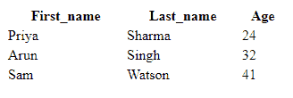
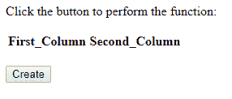
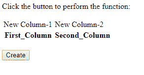
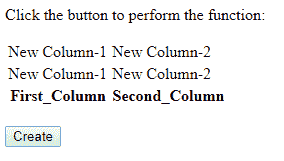
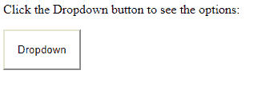
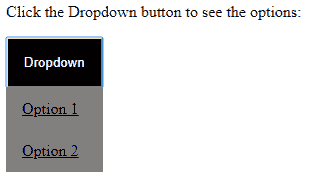

# JavaScript | JSON HTML

> 原文:[https://www.geeksforgeeks.org/javascript-json-html/](https://www.geeksforgeeks.org/javascript-json-html/)

**HTML 表格:**在 HTML 中，表格由 **<表格>** 标签定义，表格的表头由 **<第>** 标签定义，默认情况下表格的表头居中加粗，表格的行由**<【tr】>**定义，行的数据或信息由 **< td >** 标签定义。

**下面的代码展示了 HTML 表格的演示:**
**代码#1:**

```html
<!DOCTYPE html>
<html>
<body>

<table style="width:50%">
  <tr>
    <th>First_name</th>
    <th>Last_name</th> 
    <th>Age</th>
  </tr>
  <tr>
    <td>Priya</td>
    <td>Sharma</td>
    <td>24</td>
  </tr>
  <tr>
    <td>Arun</td>
    <td>Singh</td>
    <td>32</td>
  </tr>
  <tr>
    <td>Sam</td>
    <td>Watson</td>
    <td>41</td>
  </tr>
</table>

</body>
</html>
```

**输出:**


**动态 HTML 表:****insertRow()**方法将一个空的 **< tr >** 放入表中，在该定义的表中创建新行。**删除行()**方法用于从定义的表中删除行

**代码#2:**

```html
<html>

<head>
    <style>

    </style>
</head>

<body>
    <p>Click the button to perform the function:</p>
    <table id="tablecreate">
        <tr>
            <th>First_Column</th>
            <th>Second_Column</th>
        </tr>
    </table>
    <br>
    <button onclick="create()">Create</button>

    <script>
        function create() {
            var table = document.getElementById("tablecreate");
            var row = table.insertRow(0);
            var cell1 = row.insertCell(0);
            var cell2 = row.insertCell(1);
            cell1.innerHTML = "New Column-1";
            cell2.innerHTML = "New Column-2";
        }
    </script>
</body>

</html>
```

**输出:**
点击创建按钮前-


一次点击创建按钮后-


双击创建按钮后-


**HTML 下拉列表:**下拉菜单允许用户选择预定义的选项。它基本上是一个可折叠的菜单。为了创建一个下拉菜单，我们需要基本的 HTML、CSS 和 JavaScript。
**注意:**为了获得这个效果的完整结果，下面三个部分必须结合起来。

*   **HTML 部分:**按钮**<>****<a>**和 **< p >** 标签用于创建下拉菜单。
    **例:**

    ```html
    <div class="dropdown">
      <button onclick="dropdown()" class="dropbtn">Dropdown</button>
      <div id="myDropdown" class="dropdown-content">
        <a href="#">Option 1</a>
        <a href="#">Option 2</a>
      </div>
    </div>

    ```

*   **CSS 版块:** The **。dropbtn** 是可切换菜单的按钮，**背景色**设置按钮颜色，**。dropbtn:悬停**在按钮上设置悬停效果，**位置:相对；**将在下拉按钮下出现下拉菜单，使用**维护内容。下拉-内容**。
    **例:**

    ```html

    .dropbtn {
        background-color: white;
        padding: 16px;   
    }
    .dropbtn:hover, .dropbtn:focus {
        background-color: black;
        color:white;
    }
    .dropdown {
        position: relative;   
    }
    .dropdown-content {
        display: none;
        position: absolute;
        background-color: grey;
        min-width: 97px;
        overflow: auto;   
    }
    .dropdown-content a {
        color: black;
        padding: 12px 16px;
        display: block;   
    }
    .dropdown a:hover {background-color: #ddd;}
    .show {display: block;}

    ```

*   **JavaScript:**
    **示例:**

    ```html
    function dropdown() {
        document.getElementById("myDropdown").classList.toggle("show");
    }

    window.onclick = function(event) {
      if (!event.target.matches('.dropbtn')) {

        var dropdowns = document.getElementsByClassName("dropdown-content");
        var i;
        for (i = 0; i < dropdowns.length; i++) {
          var openDropdown = dropdowns[i];
          if (openDropdown.classList.contains('show')) {
            openDropdown.classList.remove('show');
          }
        }
      }
    }

    ```

**代码#3:**

```html
<html>

<head>
    <style>
        .dropbtn {
            background-color: white;
            padding: 16px;
        }

        .dropbtn:hover,
        .dropbtn:focus {
            background-color: black;
            color: white;
        }

        .dropdown {
            position: relative;
        }

        .dropdown-content {
            display: none;
            position: absolute;
            background-color: grey;
            min-width: 97px;
            overflow: auto;
        }

        .dropdown-content a {
            color: black;
            padding: 12px 16px;
            display: block;
        }

        .dropdown a:hover {
            background-color: #ddd;
        }

        .show {
            display: block;
        }
    </style>
    <script>
        function dropdown() {
            document.getElementById("myDropdown").classList.toggle("show");
        }

        window.onclick = function(event) {
            if (!event.target.matches('.dropbtn')) {

                var dropdowns = document.getElementsByClassName("dropdown-content");
                var i;
                for (i = 0; i < dropdowns.length; i++) {
                    var openDropdown = dropdowns[i];
                    if (openDropdown.classList.contains('show')) {
                        openDropdown.classList.remove('show');
                    }
                }
            }
        }
    </script>

</head>

<body>
    <p>Click the Dropdown button to see the options:</p>
    <div class="dropdown">
        <button onclick="dropdown()" class="dropbtn">Dropdown</button>
        <div id="myDropdown" class="dropdown-content">
            <a href="#">Option 1</a>
            <a href="#">Option 2</a>
        </div>
    </div>
</body>

</html>
```

**输出:**
点击下拉按钮前-


点击下拉按钮-
后