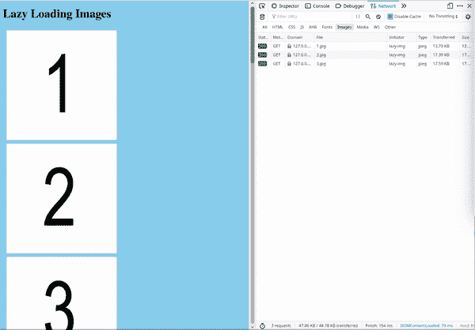

# 在 HTML 中偷懒加载图像

> 原文:[https://www.geeksforgeeks.org/lazy-loading-images-in-html/](https://www.geeksforgeeks.org/lazy-loading-images-in-html/)

**什么是懒加载？**T3】

延迟加载是一种将资源识别为非关键资源并仅在需要时加载这些资源的策略。这是一种优化网页的方法，可以减少页面加载时间。要了解更多信息:[https://www.geeksforgeeks.org/what-is-lazy-loading/](https://www.geeksforgeeks.org/what-is-lazy-loading/)

一般来说，图像的尺寸较大，因此可以使用延迟加载来延迟屏幕外的图像。

**与 JavaScript 解决方案的区别？**T3】

有许多支持延迟加载的 JavaScript 解决方案，但是最近浏览器也开始实现图像和 iframes 的延迟加载。使用浏览器方法性能更高，但目前还不完全支持。

**方法:** 要使用 Lazy Loading，使用 html 中图像标签的 Loading 属性。以下是加载属性支持的值:

*   **auto:** 默认浏览器的懒加载行为，与不包含属性相同。
*   **惰性:**延迟加载资源，直到它到达与视口的计算距离。
*   **急切:**立即加载资源，无论它位于页面的什么位置。

**示例:**

## 超文本标记语言

```html
<!DOCTYPE html>
<html lang="en">

<head>
    <meta charset="UTF-8">
    <meta name="viewport" content=
        "width=device-width, initial-scale=1.0">

    <title>Lazy Loading Images</title>
</head>

<body>
    <h1>Lazy Loading Images</h1>

    <!-- loading attribute of image tag is 
        used to specify lazy loading -->
    

    

    

    

    

    

    

    

    

    

    

    

    

    

    
</body>

</html>
```

**输出:**

