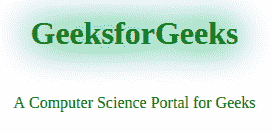

# 霓虹文字显示使用 HTML & CSS

> 原文:[https://www . geesforgeks . org/neon-text-display-using-html-CSS/](https://www.geeksforgeeks.org/neon-text-display-using-html-css/)

在本文中，您将学习使用 HTML & CSS 创建一个**霓虹文字**显示。
**霓虹文字**显示屏是最简单也是最引人注目的效果之一，用于为网页上的文字提供酷炫的设计。在霓虹灯显示中，文本的颜色会持续发光，您可以通过动画时间来控制。使用带有一些颜色组合的**文本阴影**属性，文本获得发光效果。

**方法:**首先，我们将在 span 类中添加我们想要以霓虹风格显示的文本。然后在这节课上，我们根据自己的愿望来设置字体颜色。然后我们必须使用动画属性并给它命名。在动画中，我们将动画定时设置为慢开始和慢结束时的渐入渐出，将动画迭代设置为无限以连续显示，最后将动画方向设置为交替，使动画先向前，后向后。

然后我们使用[@ T1】@关键帧@ T3 来指定动画代码。在](https://www.geeksforgeeks.org/css-keyframes-rule/)[**@关键帧**](https://www.geeksforgeeks.org/css-keyframes-rule/) 中，我们使用文本-阴影属性，并应用各种颜色组合来创建霓虹灯效果。

**例 1:**

```html
<!DOCTYPE HTML>
<html lang="en">

<head>
    <meta charset="UTF-8">
    <title>Neon text Display Using HTML and CSS</title>
    <style>
         body {
            margin: 10px;
            font-family: sans-sarif;
            height: 100%;
        }

        /* values of properties of animation assigned */
        .neon-header {
            text-align: center;
            line-height: 2;
            color: green;
            animation: neon 1s ease-in-out infinite alternate;
            margin-left: 200px;
        }

        /* various colour combinations used to create
         neon effect */
        @keyframes neon {
            from {
                text-shadow: 0 0 35px #85FF64,
                             0 0 40px #2BBF03,
                             0 0 55px #141ae2;
            }
    </style>
</head>

<body>
    <center>
    <!-- text we want to display -->
    <span class="neon-header">
        <h1>GeeksforGeeks</h1>
    </span>
        <p1>A Computer Science Portal for Geeks</p1>
    </center>
</body>

</html>
```

**输出:**


**注意:**您可以在任何标签中输出显示的文本，不需要包含在< span >标签中的文本。

**例:2** :在这个例子中，你会看到文字从阴影到其他阴影都在发光，这个更吸引眼球。

```html
<!DOCTYPE html>
<html>

<head>
    <meta name="viewport" 
          content="width=device-width, initial-scale=1">
    <title>Neon text Display Using HTML and CSS</title>
    <style>
        body {
            background-color: black;
        }

        .glow {
            font-size: 60px;
            color: green;
            text-align: center;
            animation: glow 2s ease-in-out infinite alternate;
        }

        /* Text glowing from onw shade to other shade */
        @-webkit-keyframes glow {
            from {
                text-shadow: 0 0 10px rgb(43, 255, 0),
                             0 0 20px rgb(43, 255, 0), 
                             0 0 30px #26e600, 
                             0 0 40px #26e600,
                             0 0 50px #26e600,
                             0 0 60px #26e600, 
                             0 0 70px #26e600;
            }
            to {
                text-shadow: 0 0 20px #4dff7a;
                             0 0 30px #4dff7a, 
                             0 0 40px #4dff7a,
                             0 0 50px #4dff7a, 
                             0 0 60px #4dff7a,
                             0 0 70px #4dff7a, 
                             0 0 80px #4dff7a;
            }
        }
    </style>
</head>

<body>

    <!-- Content will Glow -->
    <h1 class="glow">GeeksforGeeks</h1>

</body>

</html>
```

**输出:**
