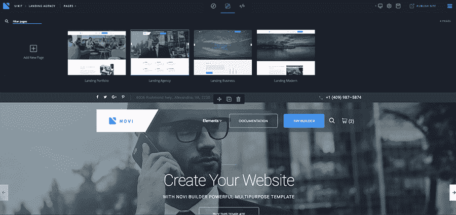
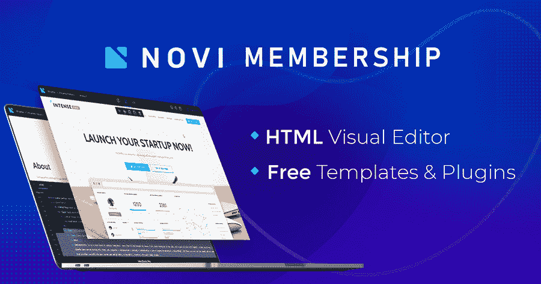

# 诺维 HTML 可视化编辑器工具

> 原文:[https://www.geeksforgeeks.org/novi-html-visual-editor-tool/](https://www.geeksforgeeks.org/novi-html-visual-editor-tool/)

Novi HTML 可视化编辑器的首次发布发生在 2016 年。那些日子网站建设不像今天这样简单和负担得起。然而，观众立即享受到了[诺维](https://novibuilder.com/visual-html-real-time-editor/)。所有技能水平的用户都能够使用它。人们最欣赏的 Novi builder 得益于以下特性:

*   直观的界面，
*   创建者友好、无代码的工作机制，
*   最新的拖放技术。

Novi HTML 可视化编辑器的故事，HTML 编辑器的技术方面非常面向用户。2016 年，WordPress 的 Elementor 是唯一提供所见即所得体验的专业拖放编辑器。所以，人们需要这样的东西来做基于 HTML 的在线项目。
尽管如此，Novi 不仅仅是一个 HTML 拖放构建器。除了舒适的界面，它还包含许多时尚的选择。一方面，Novi 允许非技术人员设计他们期待已久的网站，没有任何麻烦。另一方面，构建器变得对多个网页设计者和开发者有帮助。这种可视化的 HTML 编辑器允许全球的技术人员轻松推进工作过程。

总之，这些只是用户能够使用 Novi 执行的基本操作:

*   以无代码的方式创建干净、结构良好的网站布局，
*   发现拖放技术，
*   使用现成的内容模块设计任何共谋的页面，
*   创建访问者友好的网站导航等。

**Novi Builder–HTML 编辑器软件审核:**

回到我们的时代，他们称 Novi 为 2019 年最好的 HTML 拖放构建器。使用编辑器时，用户有许多预先设计的布局可供选择。它使网站建设过程更容易，并节省时间。
和所有专业的 HTML 编辑器软件一样，Novi 自带定期更新。工具中可用的现成内容块的数量每一季都在增加。更重要的是，Novi 允许您创建网站内容，并在实时模式下进行编辑。因此，初学者和熟练用户在使用 Novi 设计在线项目时，都可以避免犯小错误。

**Novi HTML 编辑器的系统要求:**要使用 Novi HTML 编辑器，请确保您的系统满足以下要求:

*   浏览器:Chrome 50+或 Safari 10+。
*   4GB 或更多内存。
*   最小分辨率为 1024 x 768 的显示器。
*   最小时钟速率为 1GHz 的 CPU。
*   键盘和鼠标。
*   网络连接的最低速度应为 1 兆比特。

【Novi HTML 可视化编辑器里面有哪些插件？

任何尝试过运行网站的人都知道插件有多重要。虽然 Novi 与许多插件兼容，但是您应该会看到可视化 HTML 编辑器的官方插件列表。平均来说，Novi 有 20 个易于使用的插件。

*   **背景图像插件:**这个插件是用来创建物品的背景图像的。和你在 Novi 包中看到的所有插件一样，这个插件使用简单。在它的帮助下，用户可以在几秒钟内设置背景和更改设置。
*   **背景插件:**这里还有一个 HTML 编辑器插件，可以自定义你的背景。有了它，你可以设置一个元素的背景颜色。
*   **图片插件:**这是一个必备的插件，可以替换你在线项目的图片。你有一个丰富的设置列表，可以根据个人喜好定制每张图片。
*   **Iframe Plugin:** 如果你更喜欢定制网站的各个部分，那么 Iframe Plugin 就是医生点的。得益于 Novi HTML 可视化编辑器插件，您可以选择在一个框架内显示内容的资源。
*   **链接插件:**这是一个简单的使用插件，允许改变链接。插件管理区有 3 种链接类型，包括页面、收藏夹和自定义。
*   **材质视差插件:**这个诺维插件可以使用材质视差脚本。这个插件在网站上创造了令人难以置信的视觉效果。基本上，它允许用户替换将用于视差的源图像。按照传统，有很多功能可以定制所选图像。
*   **标签插件:**您想快速更改表单域的标签吗？嗯，这就是为什么诺维创作者添加了这个插件。
*   **倒计时插件:**借助这个 HTML 拖拽生成器插件，可以设置和自定义倒计时定时器。
*   **谷歌地图插件:**它允许直观地更改地图设置。会有一个方便的图钉设置面板。您可以设置标记位置、指定标记描述等等。
*   **图标插件:**会帮你更换网站图标。
*   **猫头鹰转盘插件:**它允许在不接触一行代码的情况下配置转盘。
*   **活动监视器插件:**它允许配置表单以使用活动监视器服务。
*   **MailChimp Plugin:** 这是使用 MailChimp 服务的另一个必备工具。
*   **研发邮件表单插件:**让我们使用可视化编辑来处理研发邮件表单。
*   **RD Instagram Feed 插件:**它将你的网站和 Instagram 整合在一起。
*   **RD Twitter Feed 插件:**它用可视化编辑工具设置你的 Twitter Feed。
*   **相机滑块插件:**允许用户配置相机滑块。
*   **Swiper Slider 插件:**可以根据自己的喜好设置 Swiper Slider。
*   **视频插件:**它允许你设置你的视觉展示。
*   **灯光画廊插件:**允许创建画廊。

可以查看 Novi Builder 的[文档](https://novibuilder.com/documentation/)获取更多信息。

**新手会员:如何使用 HTML 编辑器保存？**

首先，您需要[购买诺维会员资格](https://novibuilder.com/pricing/)才能开始使用诺维构建器。有三种不同的会员资格可供选择。
每个用户都提供以下功能:

*   Novi HTML 拖放生成器。
*   新潮、高质量的 HTML 模板。
*   基本插件。

**最终想法:**

综上所述，以下是为您的网站选择 Novi HTML 可视化编辑器的主要可能性:

*   实时模式下的内容编辑。
*   导入不同的基于 HTML 的主题。
*   定制大量用户界面和 UX 组件。
*   使用大量现成的内容块。
*   快速设置任何元素。
*   管理媒体库。
*   编辑文本、链接和背景。
*   更改配色方案、渐变和图像。
*   使用字体和图标。
*   用 Novi IDE 代码编辑器玩 CSS、HTML 和 JS 代码。
*   添加联系人表单、弹出窗口和地图。
*   使用视觉效果。
*   制作旋转木马、倒计时器、滑块等。