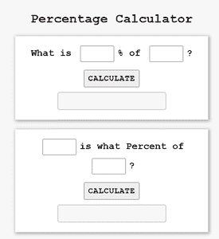
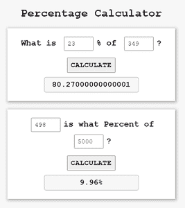

# 使用 HTML CSS 和 JavaScript 的百分比计算器

> 原文:[https://www . geesforgeks . org/percent-calculator-use-html-CSS-and-JavaScript/](https://www.geeksforgeeks.org/percentage-calculator-using-html-css-and-javascript/)

要计算百分比吗？如果是，那么您可以使用 HTML、CSS 和 JavaScript 制作一个简单的百分比计算器。在本文中，您必须在第一个输入字段中输入获得的分数，在第二个输入字段中输入总分数来计算百分比。输入值并单击计算按钮后，可以获得百分比。这个非常有用的项目用于计算分数、折扣等。百分比计算器对学生、店主和解决与百分比相关的基本数学问题都很有用。

**文件结构**

*   index.html
*   style.css
*   script.js

**先决条件:**需要 HTML、CSS、JavaScript 的基础知识。该项目包含 HTML、CSS 和 JavaScript 文件。HTML 文件增加了结构，随后使用 CSS 和 JavaScript 进行样式化，为其增加了功能，并对项目的某些部分进行了验证。

HTML 布局是使用 div 标签、id 属性、类、表单和表单提交按钮创建的。它定义了网页的结构。

## index.html

```html
<!DOCTYPE html>
<html lang="en">

<head>
    <meta charset="UTF-8">
    <meta http-equiv="X-UA-Compatible" content="IE=edge">
    <meta name="viewport" content=
        "width=device-width, initial-scale=1.0">
    <title>Percentage Calculator</title>
    <link rel="stylesheet" href="style.css" type="text/css" />
</head>

<body>
    <h1>Percentage Calculator</h1>

    <div>

        <!-- Defines a field for entering a number-->
        <h2> What is <input type="number" id="percent" />% of
            <input type="number" id="num" />?
        </h2>

        <!-- onclick event is to call the function when
            user click on the button-->
        <button onclick="percentage_1()">Calculate</button><br>

            <!-- Read-only input field to display 
            output and cannot be modified -->
        <input type="text" id="value1" readonly />
    </div>

    <div>
        <!-- Defines a field for entering a number -->
        <h2><input type="number" id="num1" />
            is what Percent of
            <input type="number" id="num2" />?
        </h2>

        <!-- onclick event is to call the function 
            when user click on the button -->
        <button onclick="percentage_2()">Calculate</button></br>

        <!-- Read-only input field to display 
            output and cannot be modified -->
        <input type="text" id="value2" readonly />
    </div>

    <script type="text/javascript" src="script.js"></script>
</body>

</html>
```

通过使用 CSS 属性，我们将根据项目的要求，使用颜色、宽度、高度和位置属性来装饰网页。CSS 设计计算器的界面。

## style.css

```html
/* A margin and padding are provided 0 
box-sizing border box is used to include 
padding and border in the total width 
and height of the element, and font-family 
can be specified by the user */
* {
    margin: 0;
    padding: 0;
    box-sizing: border-box;
    font-family: 'Courier New', Courier, monospace;
}

/* The user display allows you to specify the
background colour and height. The 
display:flex property, which is aligned at the
centre, is used to fill available free space 
or to shrink them to prevent overflow. */
body {
    background-color: #f7f7f7;
    min-height: 100vh;
    display: flex;
    justify-content: center;
    align-items: center;
    flex-direction: column;
}

/* font-weight Specifies weight of glyphs 
in the font, their degree of blackness or 
stroke */
h1 {
    font-weight: 900;
    margin-bottom: 12px;
}

div {
    width: 480px;
    background-color: #fff;
    margin: 12px 0;
    padding: 24px;
    text-align: center;
    box-shadow: 2px 2px 8px 2px #aaa;
}

input[type=number] {
    width: 84px;
    font-size: 18px;
    padding: 8px;
    margin: 0px 8px 8px 8px;
}

/* The text-transform:uppercase property 
causes characters to be raised to uppercase. 
The button's font-weight, font-size, and 
cursor type can be customised by the user. */
button {
    text-transform: uppercase;
    font-weight: 900;
    font-size: 20px;
    margin: 12px 0;
    padding: 8px;
    cursor: pointer;
    letter-spacing: 1px;
}

/* The font-weight, font-size, background-color, 
and border can all be customized by the user. 
The border-radius property allows you to give 
an element rounded corners.*/
input[type=text] {
    font-size: 22px;
    padding: 8px 0;
    font-weight: 900;
    text-align: center;
    background-color: #f7f7f7;
    border: 2px solid #ccc;
    border-radius: 6px;
}
```

为了给网页增加功能，使用了 JavaScript 代码。在这种情况下，两个函数 percent 1()和 percent 2()被声明并通过 onclick 事件传递给按钮。因此，当按下“计算”按钮时，将显示结果。我们使用了方法 document.getElementById()。它返回具有指定标识属性的元素，如果不存在具有指定标识的元素，则返回空值。

**使用的公式:**

> **Y 的 X 百分比是多少由公式给出:**
> Y 的 X 百分比=(X/100)* Y
> 
> **X 是 Y 的百分之几由公式给出:**
> X 是 Y 的百分之几= (X/Y)×100%，其中 X，Y > 0

## script.js

```html
function percentage_1() {

    // Method returns the element of percent id
    var percent = document.getElementById("percent").value;

    // Method returns the element of num id
    var num = document.getElementById("num").value;
    document.getElementById("value1")
        .value = (num / 100) * percent;
}

function percentage_2() {

    // Method returns the element of num1 id
    var num1 = document.getElementById("num1").value;

    // Method returns the elements of num2 id
    var num2 = document.getElementById("num2").value;
    document.getElementById("value2")
        .value = (num1 * 100) / num2 + "%";
}
```

#### 输出:

*   **最初-**



百分比计算器

*   **输入一些数据后点击计算按钮-**



百分比计算器