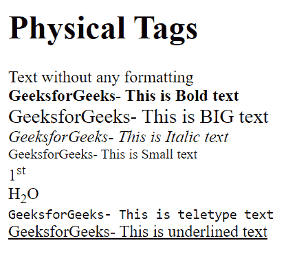

# HTML 中的物理和逻辑标签

> 原文:[https://www . geesforgeks . org/physical-and-logic-tags-in-html/](https://www.geeksforgeeks.org/physical-and-logical-tags-in-html/)

物理和逻辑标签在 HTML 中使用，以便用户在网页上更好地看到和理解文本。但是，这两个标签的名称不同。

**逻辑标签:**
在 HTML 中使用逻辑标签按照逻辑样式显示文本。以下是 HTML 中常用的逻辑标签。

**逻辑标记**

<figure class="table">定义一个地址元素T64】定义插入文本

| mark | describe |
| --- | --- |
|  | Define an abbreviation |
| T108] Abbreviation > | Define an abbreviation |
| T110] Address > | blockquote > | Define long quotation marks |
|  | Define text |
| t120〔dfn〕 | Define terms |
| ins <> |
| <samp></samp> | Define sample computer code |
|  | Define strong text |
| T134 已存在> | Define a variable |

</figure>

**使用逻辑标签的示例代码:**

## 超文本标记语言

```html
<!DOCTYPE html>
<html>
<head>
<title>Page Title</title>
</head>
<body>

<h1> Logical Tags </h1>

Welcome to <abbr title="GeeksforGeeks"> GFG</abbr> <br>

This is <acronym title="GeeksforGeeks">GFG</acronym> <br>

<address> GeeksforGeeks, 5th & 6th Floor, Royal Kapsons, A- 118, Sector- 136, Noida, 
Uttar Pradesh (201305) </address> <br>

<cite> GeeksforGeeks </cite> is my favourite website. <br>

<code> Sample code: system.out.println(); </code>

<blockquote cite="https://www.geeksforgeeks.org/">
A Computer Science portal for geeks. It contains well written, well thought and well 
explained computer science and programming articles, and quizzes.
</blockquote>

<del> This contains deleted content.</del>

<ins> Newly inserted content.</ins>

<p>
<dfn> GeeksforGeeks </dfn> is a Computer Science portal for geeks. It contains well 
written, well thought and well explained computer science and programming articles, 
and quizzes.
</p>

<kbd> GeeksforGeeks - This is a Keyboard input </kbd>

<pre>    Dear User,

    Congratulations !!

    We are delighted to inform you that you are going to be part of GfG journey.

    Thanks,
    GfG Team

This is a predefine formatted text </pre>  

</body>
</html>
```

**输出:**


**<u>物理标签</u>**

物理标签在 HTML 中用于为文本提供实际的物理格式。以下是 HTML 中常用的物理标签。

**物理标记**

<figure class="table">T21T30】T80 <sup>上标</sup>文字 T70】弃用。 使用样式代替

| mark | describe |
| --- | --- |
|  | Define **bold** text |
| 大 | Define large characters |
|  | Define <sub>subscript</sub> text |
|  | Define telex text |
| T90】u > |

</figure>

**使用物理标签的示例代码:**

## 超文本标记语言

```html
<!DOCTYPE html>
<html>
<head>
<title>Physical Tags</title>
</head>
<body>

<h1> Physical Tags </h1>
Text without any formatting <br>
<b> GeeksforGeeks- This is Bold text </b> <br>
<big> GeeksforGeeks- This is BIG text </big> <br>
<i> GeeksforGeeks- This is Italic text </i> <br>
<small> GeeksforGeeks- This is Small text </small> <br>
1<sup>st </sup> <br>
H<sub>2</sub>O <br>
<tt> GeeksforGeeks- This is teletype text </tt> <br>
<u> GeeksforGeeks- This is underlined text</u> <br>

</body>
</html>
```

**输出:**

